# Programming Languages
## Week 2 — Describing Syntax

Sebesta, Section 3.1-3.3

---

# Today (slow build)

1. Why we need grammars
2. BNF notation — one symbol at a time
3. Simple rules → assignment → expressions
4. Lists in pure BNF
5. Parse trees and derivations
6. Ambiguity
7. Precedence — layer by layer
8. Associativity — left, then right
9. **EBNF last** — shorthand for what we already did

---

# Where this fits

Last week: **why** languages exist and how we **evaluate** them.

This week: how we **describe** legal program **shape** with BNF.

Next week: semantics, lexing, parsing (Lab 1 lexer due end of Week 3).

---

# Syntax vs semantics

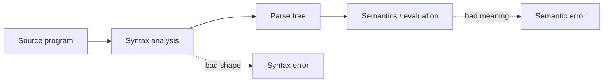

**Syntax** — is this string a legal program?  
**Semantics** — what does it **do**?

Grammar handles syntax only.

---

# The problem with English

> “An assignment is a variable, an equals sign, and an expression.”

Sounds fine — but:

- What counts as a variable?
- How long can an expression be?
- Can `+` appear twice in a row?

We need rules that are **complete** and **unambiguous**.

---

# BNF — notation (Sebesta / textbook)

**Sebesta uses `→`** (“can be replaced by” / “is defined as”).

Other books often write `::=` — **same meaning**.

| Symbol | Read as |
| --- | --- |
| `→` | “is defined as” |
| `|` | “or” (pick one alternative) |
| `<name>` | **Nonterminal** — a category we still expand |
| `id`, `+`, `=` | **Terminals** — tokens from the lexer (leaves) |

We follow **Sebesta’s `→`** in all grammar rules below.

---

# Step 0 — the `id` terminal

Before rules get interesting, meet **`id`**:

- Stands for an **identifier token** from the lexer
- In **examples** we write concrete names: `a`, `x`, `count`
- In **grammar** we write the token class: `id`

| Grammar | Example strings |
| --- | --- |
| `<name> → id` | `a`, `x`, `count` (each is one `id`) |

The grammar describes **shape**; the lexer decides which character sequences are valid ids.

---

# Step 0 — side by side

| Grammar | Example: `a` |
| --- | --- |
| `<name> → id` | concrete lexeme `a` matches token `id` |

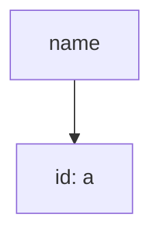

Parse tree leaf shows **token type** `id` and (in examples) the actual name.

---

# Step 0 — other terminals (preview)

Same idea as `id` — token classes, not every possible spelling:

| Terminal | Examples in source |
| --- | --- |
| `id` | `a`, `x`, `myVar` |
| `number` | `0`, `42`, `3.14` |
| `+`, `-`, `*`, `=` | the operator symbols |
| `if`, `then`, `else`, `print` | keywords |

Grammar uses **`id`**; your lexer returns `(ID, "a")` or similar.

---

# Step 0b — digits (optional pattern)

Same BNF style for a fixed set of choices:

```
<digit> → 0 | 1 | 2 | 3 | 4 | 5 | 6 | 7 | 8 | 9
```

| Grammar | Example |
| --- | --- |
| `<digit> → 0 through 9` | string `7` |

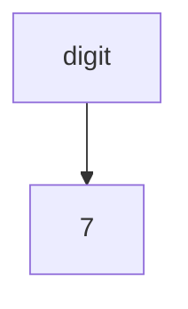

We will use **`id`** much more than `<digit>` in this course.

---

# Step 1 — chain two symbols

```
<assign> → id = id
```

| Grammar | Legal strings |
| --- | --- |
| `<assign> → id = id` | `x = y`, `a = b` |

Only **exactly** `id = id`. No expressions yet.

| Example string | Legal? |
| --- | --- |
| `x = y` | yes |
| `x = y + z` | **no** — grammar does not allow `+` yet |

---

# Step 1 — parse tree

| String | Tree |
| --- | --- |
| `a = b` | |

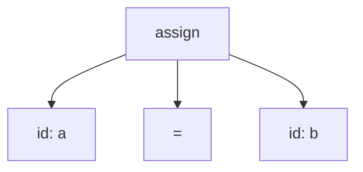

Root = start symbol. Leaves = terminals (`id`, `=`).

---

# Step 2 — add a third piece (still simple)

```
<assign> → id = <expr>
<expr>   → id
```

| What changed | |
| --- | --- |
| Right side of `=` is now a **category** `<expr>` | |
| `<expr>` is just `id` for now | |

| Example | Legal? |
| --- | --- |
| `x = y` | yes — `<expr> → id` |
| `x = 42` | only after we add `number` to `<expr>` |

---

# Step 2 — derivation (leftmost)

Build `a = b` one rewrite at a time:

| Step | Sentence so far |
| --- | --- |
| 1 | `<assign>` |
| 2 | `id = <expr>` |
| 3 | `id = id` |
| 4 | `a = b` *(concrete ids)* |

Each step replaces **one** nonterminal using a rule with `→`.

---

# Step 3 — one binary operator

```
<assign> → id = <expr>
<expr>   → id + id
```

| Example | Legal? |
| --- | --- |
| `x = a + b` | yes |
| `x = a + b + c` | **no** — only two ids around one `+` |
| `x = a * b` | **no** — `*` not in grammar yet |

One feature per step.

---

# Step 3 — side by side

| Grammar | String `x = a + b` |
| --- | --- |
| `<assign> → id = <expr>` | |
| `<expr> → id + id` | |

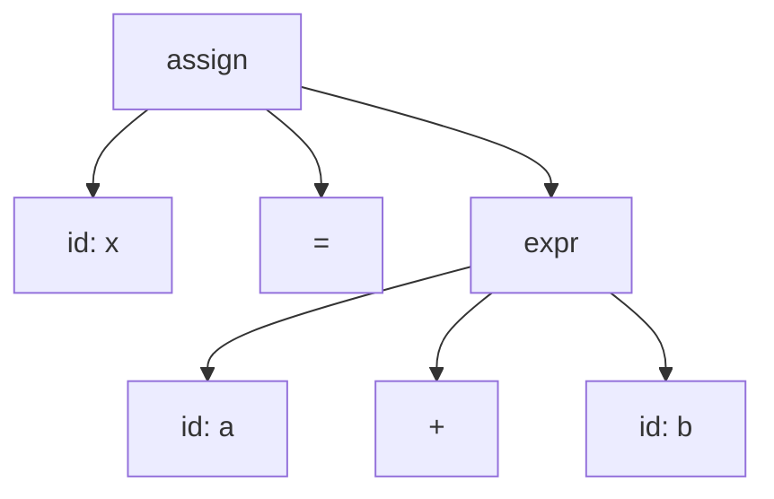

---

# Step 4 — alternatives with `|`

Statements can be more than one kind of thing:

```
<program> → <stmt>
<stmt>    → <assign> | <print>
<assign>  → id = <expr>
<expr>    → id + id | id
<print>   → print id
```

`|` = choose **exactly one** alternative. Not “optional” — not “repeat”.

---

# Step 4 — which branch?

| String | Rules used |
| --- | --- |
| `x = y` | `<stmt> → <assign>`, `<expr> → id` |
| `x = a + b` | `<stmt> → <assign>`, `<expr> → id + id` |
| `print x` | `<stmt> → <print>` |

Same start symbol, different shapes — `|` picks the path.

---

# Step 5 — lists in pure BNF

We want: `print a`, `print a, b`, `print a, b, c`, …

EBNF would write `{ ... }` — **not yet**. In BNF we use **two rules**:

```
<id-list> → id
<id-list> → <id-list> , id
<print>   → print <id-list>
```

Base case + recursive case = “one or more” `id`s.

---

# Step 5 — list side by side

| Grammar | String `print a, b, c` |
| --- | --- |
| `<id-list> → id` | |
| `<id-list> → <id-list> , id` | *(two rules)* |

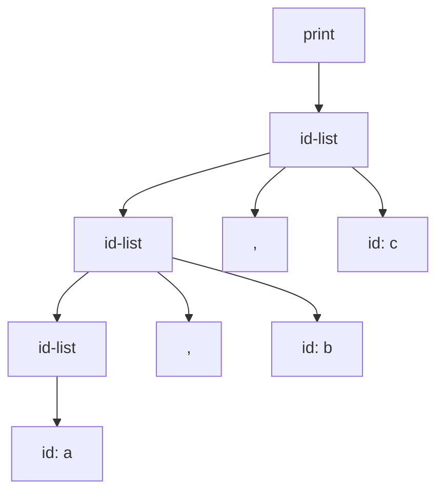

Grammar grows **to the left** — we will see that again with associativity.

---

# Step 5 — list derivation

| Step | Result |
| --- | --- |
| 1 | `<print>` → `print <id-list>` |
| 2 | `<id-list>` → `<id-list> , id` |
| 3 | `<id-list>` → `<id-list> , id` |
| 4 | `<id-list>` → `id` |
| 5 | Replace ids → `print a , b , c` |

Unwind from the **base case** (`id`) outward.

---

# Step 6 — add `if` (still pure BNF)

```
<stmt>    → <assign> | <print> | <if-stmt>
<if-stmt> → if <expr> then <stmt>
<if-stmt> → if <expr> then <stmt> else <stmt>
```

Two rules for if-with-else vs if-without-else — verbose but clear.

---

# Step 6 — if side by side

| Grammar | String `if x then y = z` |
| --- | --- |
| `<if-stmt> → if <expr> then <stmt>` | `<expr>→id`, `<stmt>→<assign>` |

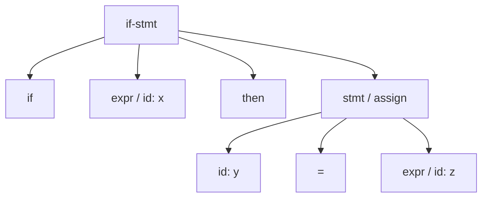

---

# Pause — what we have so far

| Feature | BNF technique |
| --- | --- |
| Categories | Nonterminals `<...>` |
| Choices | `|` between alternatives |
| Sequences | `A B C` on one line |
| Lists | Base + recursive rule |
| `id` | Terminal for any identifier |
| If | Separate rules per form |

Still missing: **precedence**, **associativity**, and fixing **ambiguity**.

---

# Parse trees — why they matter

A grammar can **generate** a string many ways — or one way.

The **parse tree** records **which rules** were used.

Compilers use the tree (or an AST) — not the raw string.

---

# Ambiguity — definition

| Term | Meaning |
| --- | --- |
| **Ambiguous grammar** | Same string, **two different** parse trees |
| **Unambiguous grammar** | Each string has **exactly one** tree |

Ambiguity is a **grammar bug** to fix — not something to “interpret away.”

---

# A deliberately bad expression grammar

```
<expr> → <expr> + <expr>
<expr> → <expr> * <expr>
<expr> → id
```

Looks flexible — but broken for `a + b * c`.

---

# `a + b * c` — tree 1

| Grammar (same as before) | Parse 1: `(a + b) * c` |
| --- | --- |


---

# `a + b * c` — tree 2

| Grammar (same as before) | Parse 2: `a + (b * c)` |
| --- | --- |

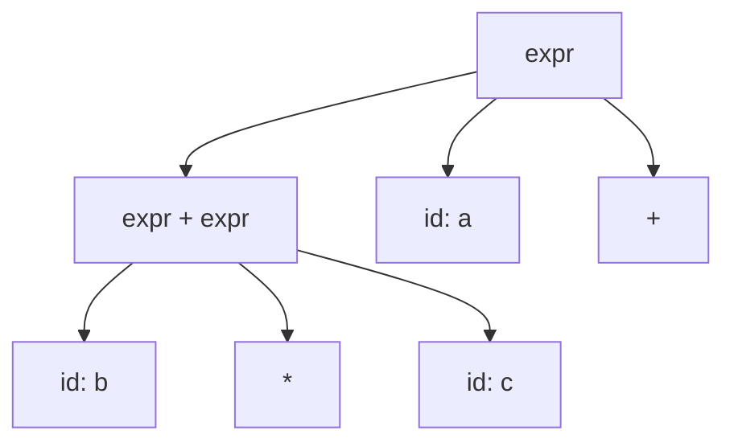

Same string. Two trees. **Ambiguous.**

---

# Precedence — the idea

When `+` and `*` mix, we usually want `*` to bind tighter:

`a + b * c`  means  `a + (b * c)`  not  `(a + b) * c`

**Precedence** = which operator groups first.

**Fix:** split into **levels** — one nonterminal per precedence level.

---

# Precedence — step 1: names for levels

| Level | Nonterminal | Operators (for now) |
| --- | --- | --- |
| Low | `<expr>` | `+` |
| High | `<term>` | `*` |
| Atomic | `<factor>` | `id` |

Lower in the table = **looser** binding = parsed **higher** in the tree.

---

# Precedence — step 2: grammar

```
<expr>   → <expr> + <term> | <term>
<term>   → <term> * <factor> | <factor>
<factor> → id
```

`*` lives **inside** `<term>` — it must resolve before `+` at `<expr>` level.

---

# Precedence — side by side

| Grammar | `a + b * c` — **one** tree |
| --- | --- |
| layered rules above | |

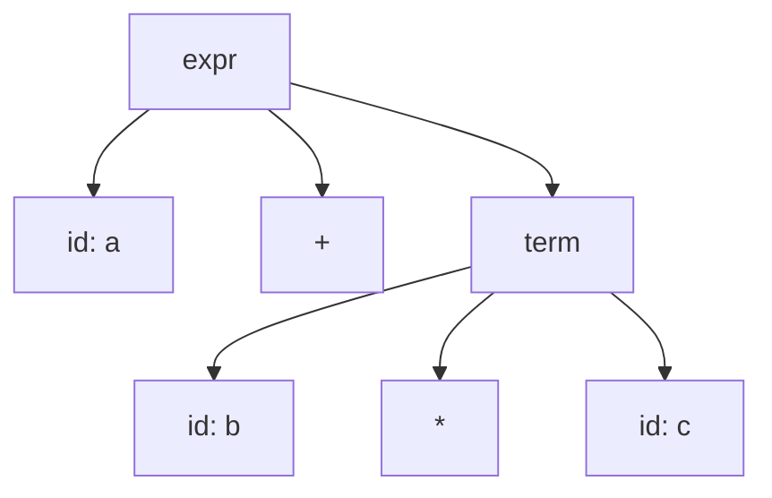

Only `a + (b * c)` — unambiguous for this case.

---

# Precedence — add parentheses

```
<factor> → id | ( <expr> )
```

| String | Meaning |
| --- | --- |
| `(a + b) * c` | Parens force `+` inside a `<factor>` before `*` applies |

Parentheses = “treat this `<expr>` as one `<factor>`.”

---

# Precedence stack (picture)

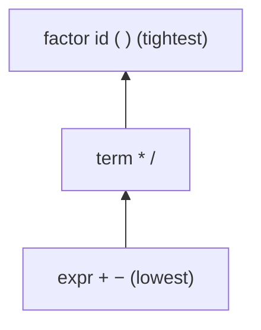

When writing grammar: **one nonterminal per row**.

---

# Associativity — the idea

Precedence handles **different** operators.

**Associativity** handles **same** operator repeated:

| String | Left-assoc | Right-assoc |
| --- | --- | --- |
| `a - b - c` | `(a - b) - c` | `a - (b - c)` |
| `a + b + c` | `(a + b) + c` | `a + (b + c)` |

Grammar shape picks left vs right.

---

# Left associativity — grammar grows left

```
<expr> → <expr> - <term> | <term>
```

For `a - b - c`:

| Grammar | Tree (left-assoc) |
| --- | --- |

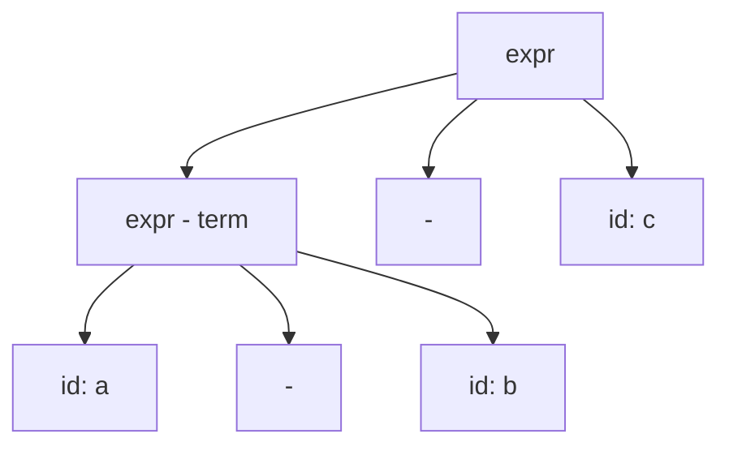

Structure: `((a - b) - c)`.

---

# Right associativity — grammar grows right

```
<assign> → id = <assign> | <expr>
```

For `a = b = c`:

| Grammar | Tree (right-assoc) |
| --- | --- |

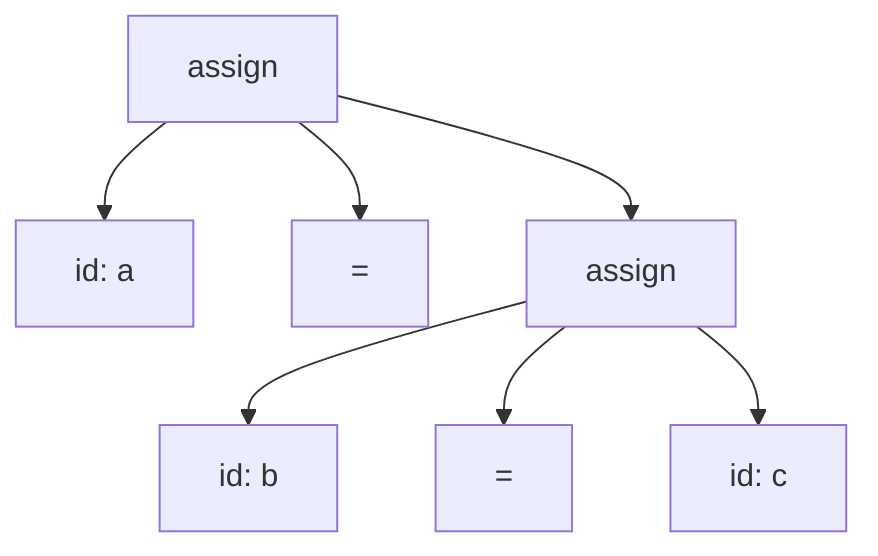

Structure: `(a = (b = c))`.

---

# Side by side — left vs right

| Left-assoc (`<expr> → <expr> + <term>`) | Right-assoc (`<assign> → id = <assign>`) |
| --- | --- |
| New operator attaches to **left** subtree | New `=` attaches to **right** subtree |
| `a + b + c` → `(a+b)+c` | `a = b = c` → `a = (b=c)` |
| Typical: `+`, `-`, `*`, `/` | Typical: `=`, `**`, some logical ops |

The recursion direction **is** the associativity.

---

# Full expression grammar (BNF)

```
<assign> → id = <expr>
<expr>   → <expr> + <term> | <expr> - <term> | <term>
<term>   → <term> * <factor> | <term> / <factor> | <factor>
<factor> → id | number | ( <expr> )
```

Built in layers — same pattern every time you add an operator level.

---

# Dangling else — the ambiguity

| String | Question |
| --- | --- |
| `if a then if b then s1 else s2` | Does `else` go with **inner** or **outer** `if`? |

Simple BNF with one `<if-stmt>` rule → **two parse trees** (bad).

---

# Dangling else — fix in BNF (matched / unmatched)

```
<stmt>      → <matched> | <unmatched>
<matched>   → if <expr> then <matched> else <matched> | <assign> | …
<unmatched> → if <expr> then <stmt>
<unmatched> → if <expr> then <matched> else <unmatched>
```

More rules — but **one** tree per string. Standard fix.

---

# Concrete vs abstract syntax

| | Concrete (parse tree) | Abstract (AST) |
| --- | --- | --- |
| Shows | Punctuation, every nonterminal | Just the computation shape |
| Lab 2 | Parser output can be concrete | You will simplify to AST |

Example: `a + b * c` → `Plus(a, Mul(b, c))` — no `<term>` nodes needed in AST.

---

# Now — EBNF (shorthand at the end)

We already know how to write lists, option, and repeat in **pure BNF**.

EBNF is **notation sugar** — same languages, fewer lines.

| Idea | Pure BNF (what we did) | EBNF shorthand |
| --- | --- | --- |
| Optional | Two separate rules | `[ else <stmt> ]` |
| Zero or more | Base + recursive rule | `{ <stmt> ; }` |
| Grouping | Extra nonterminals | `( ... )` in meta-syntax |

Sebesta also uses EBNF-style `[ ]` and `{ }` in places — same idea.

---

# EBNF — side by side: list

| Pure BNF | EBNF |
| --- | --- |
| `<id-list> → id` | `<id-list> → id { , id }` |
| `<id-list> → <id-list> , id` | |

Same language: `a`, `a,b`, `a,b,c`, …

---

# EBNF — side by side: optional else

| Pure BNF | EBNF |
| --- | --- |
| `<if-stmt> → if <expr> then <stmt>` | `<if-stmt> → if <expr> then <stmt> [ else <stmt> ]` |
| `<if-stmt> → if <expr> then <stmt> else <stmt>` | |

One line instead of two rules — still watch for **dangling else** ambiguity.

---

# EBNF — side by side: expression

| Pure BNF (layered) | EBNF (same structure) |
| --- | --- |
| three-level expr / term / factor | `<expr> → <term> { (+ -) <term> }` |
| left-recursive rules | `<term> → <factor> { (* /) <factor> }` |

```
<factor> → id | ( <expr> )
```

`{ ... }` = repeat; precedence still comes from **expr vs term vs factor**.

---

# EBNF — side by side: full stmt (sketch)

| Pure BNF style | EBNF style |
| --- | --- |
| Many rules for stmt, assign, if-stmt, … | see below |
| List via two-rule recursion | `<print> → print id { , id }` |

```
<stmt> → <assign> | <print> | <if-stmt> | …
```

Use EBNF to **publish** TinyLang; understand BNF to **debug** ambiguity.

---

# Chomsky hierarchy (one slide)

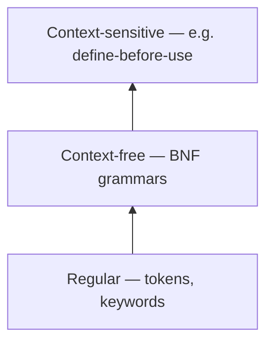

Your lexer ≈ regular. Your parser ≈ context-free.

---

# Designing TinyLang — checklist

1. Terminals = token types from Lab 1 lexer (`id`, `number`, …)
2. Start symbol = `<program>` or `<stmt-list>`
3. Build **simple** → add lists → add precedence layers → fix associativity
4. Test ambiguous strings **before** coding Lab 2
5. Write **BNF first** if confused; convert to EBNF for the spec

---

# Week 2 wrap

| Topic | Takeaway |
| --- | --- |
| BNF | `→` (Sebesta), `|`, nonterminals, terminals |
| `id` | Token class; examples use `a`, `x`, … |
| Lists | Base case + recursive rule |
| Precedence | Separate nonterminals per level |
| Associativity | Left vs right recursion |
| Ambiguity | Fix the grammar, not the parser’s guess |
| EBNF | Shorthand — learn after BNF |

---

# Before next class

**Read:** Section 3.4-3.5; Section 4.1-4.4

**Work:** Draft TinyLang grammar (BNF or EBNF); grammar problem set

**Lab 1** (lexer) due end of Week 3

---

# Homework prompts

1. In **pure BNF** with `→`, write a comma-separated `<expr-list>` (one or more expressions).
2. Draw **one** parse tree for `x = a + b * c` using the layered grammar.
3. Show **left** vs **right** tree for `a - b - c` and `a = b = c`.
4. Rewrite optional-else `if` using **matched/unmatched** (BNF only).
5. Convert one of your BNF rules to EBNF using `{ }` or `[ ]`.
