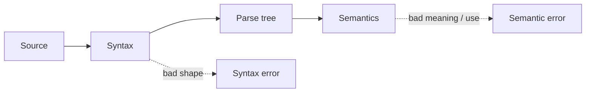
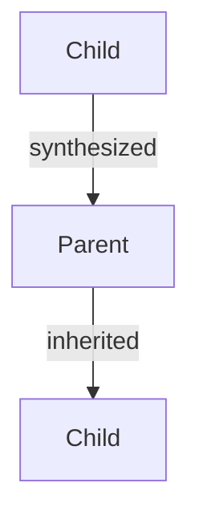
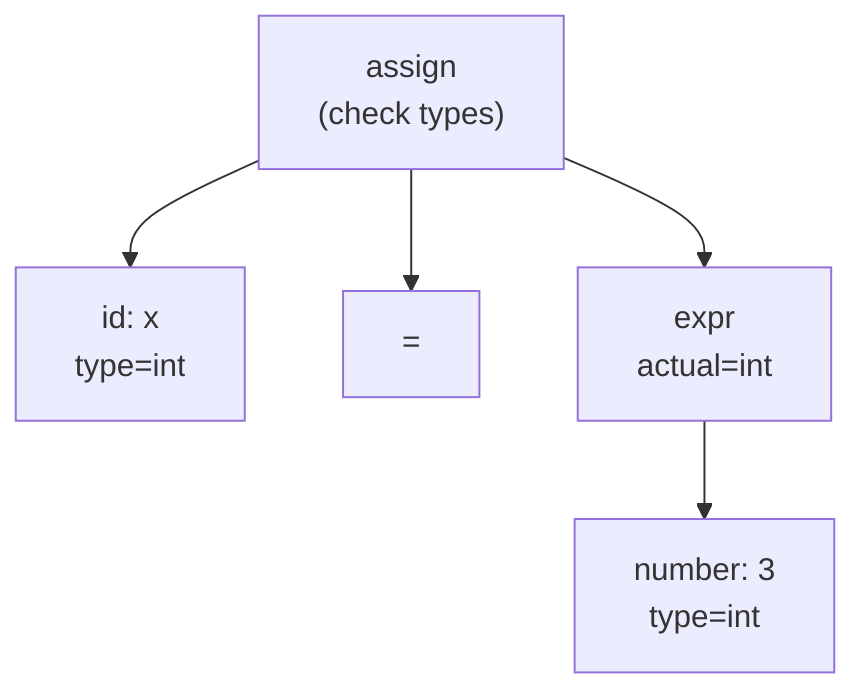
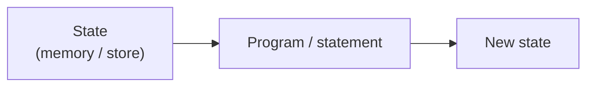
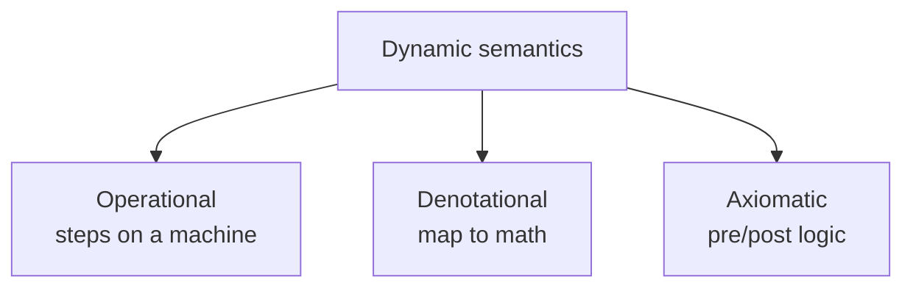

# Programming Languages
## Week 3 — Part 1: Attribute Grammars & Dynamic Semantics

Sebesta, Section 3.4-3.5

---

# Today (Part 1)

1. Beyond BNF — what syntax alone cannot say
2. Static vs dynamic semantics
3. Attribute grammars (Section 3.4)
4. Dynamic semantics survey (Section 3.5)
   - Operational
   - Denotational
   - Axiomatic

**Part 2 later:** Chapter 4 — lexing and recursive-descent parsing (Lab 1)

---

# Where this fits

| Week | Focus |
| --- | --- |
| 2 | BNF — **shape** of legal programs |
| 3 Part 1 | Meaning & **context** rules (this deck) |
| 3 Part 2 | How tools **find** tokens and trees |
| Labs | Your interpreter implements a **operational** meaning |

---

# Reminder — syntax vs semantics



**Syntax:** Is the string well-formed?  
**Semantics:** What does it **mean** / is it used legally?

---

# BNF is not enough

This program can be **syntactically perfect** and still wrong:

```
int x;
x = "hello";
```

Shape is fine (declaration + assignment).  
**Types don't match** — that is not a BNF issue.

---

# Another example BNF cannot catch

```
y = x + 1;   // x never declared
```

Grammar may allow any `id` on the right.  
**“Declare before use”** needs **context** — information from elsewhere in the program.

---

# Static vs dynamic semantics

| | **Static semantics** | **Dynamic semantics** |
| --- | --- | --- |
| When | Compile / analyze time | Run time |
| Examples | Types, declare-before-use, number of args | What `x = x + 1` **does** |
| Goal | Catch errors early; describe constraints | Describe **behavior** |

Section 3.4 ≈ static (via attribute grammars).  
Section 3.5 ≈ dynamic (three formal styles).

---

# Static semantics — informal list

Rules that depend on **context**, not just local shape:

- Identifier declared before use
- Types compatible in expressions / assignments
- Correct number of parameters
- Break only inside a loop (in some languages)

BNF alone: **no**. Attribute grammars: **a way to attach** those rules to a grammar.

---

# Section 3.4 — Attribute grammars

**Idea:** Start with a BNF (or CFG).  
Decorate symbols with **attributes** (extra values).  
Add **semantic rules** and **predicates** that relate those attributes.

Parse tree → **decorated** parse tree (nodes carry attribute values).

---

# Attributes — two flavors

| Kind | Flow | Typical use |
| --- | --- | --- |
| **Synthesized** | Child → parent | Compute result type of an expression |
| **Inherited** | Parent / sibling → child | Pass expected type or environment down |



---

# Tiny example — “expected type”

Informal rule: in `x = expr`, the type of `expr` must match the type of `x`.

| Piece | Attribute idea |
| --- | --- |
| `x` | `type` = type looked up for `x` |
| `expr` | `expected_type` inherited from assignment |
| `expr` | `actual_type` synthesized from subexpressions |
| Predicate | `actual_type == expected_type` |

If predicate fails → **static semantic error**.

---

# Attribute grammar pieces (Sebesta)

For each grammar rule `X → …`, you may have:

1. **Semantic functions** — compute attribute values  
   e.g. `X.type ← Y.type`
2. **Predicate functions** — boolean checks  
   e.g. `Y.type == Z.type`

If any predicate is false for a decorated tree, the program is **statically illegal**.

---

# Classic textbook flavor — type of an expression

Grammar (sketch):

```
<expr> → <expr> + <term>
       | <term>
```

Informal attribute rules:

| Rule | Synthesized idea |
| --- | --- |
| `<term>` is `id` | type comes from declaration of that id |
| `<expr> → <expr> + <term>` | result type = type of `+` on the two child types |

If both children are `int`, result is `int`.  
If one is `float`, maybe `float` — **language design choice**.

---

# Side by side — BNF vs attribute grammar

| BNF alone | Attribute grammar |
| --- | --- |
| `<assign> → id = <expr>` | same rule **plus** |
| | `id.type` known from symbol table |
| | `<expr>.expected ← id.type` (inherited) |
| | check `<expr>.actual == id.type` |

Same **shape**; extra **meaning constraints**.

---

# Decorated parse tree (picture)



Leaves get types; parents **synthesize** or **check**.

---

# Why attribute grammars matter (even if you never write one)

- Formal way to talk about **static semantics**
- Compilers implement the *idea* (symbol tables, type checkers) even when they do not use Knuth-style AG notation
- Connects grammar structure to **semantic analysis**

For this course: **recognize the idea**; skim dense AG formalisms in the book.

---

# Attribute grammars — wrap

| Term | Remember |
| --- | --- |
| Attribute | Extra info on a grammar symbol |
| Synthesized | Computed from children |
| Inherited | Passed into a node |
| Predicate | Static check (pass/fail) |
| Goal | Describe **context-sensitive** constraints |

---

# Section 3.5 — Dynamic semantics

Now: assume the program is **well-formed**.  
What does it **mean** when it runs?

Three classic approaches (survey — not a full formal methods course):

1. **Operational**
2. **Denotational**
3. **Axiomatic**

---

# Why formalize meaning?

Natural language (“`x++` adds one to `x`”) is:

- Fuzzy at the edges
- Hard to prove programs against
- Ambiguous for language lawyers

Formal semantics supports:

- Language specs
- Compilers / interpreters
- Program proofs

---

# 1 — Operational semantics

**Meaning = how a machine executes the program.**

Describe a **state** and **transition rules**:

```
state  +  statement  →  new state
```

If you can simulate every step, you know the meaning.

---

# Operational — state (simple picture)



Example state: `{ x ↦ 3, y ↦ 7 }`  
After `x = x + 1` → `{ x ↦ 4, y ↦ 7 }`

---

# Operational — levels of detail

| Style | Detail |
| --- | --- |
| **Natural / high-level** | Rules over AST-like constructs |
| **Structural** | Compositional rules per construct |
| **Low-level** | Almost a virtual machine (registers, PC) |

Your **mini interpreter** is operational semantics in code:

**AST + environment → evaluate → new values**

---

# Operational — assignment (sketch)

Informal rule:

> To execute `id = expr` in state σ:  
> 1. Evaluate `expr` in σ → value *v*  
> 2. Update σ so `id` maps to *v*

That is the **meaning** of assignment in operational form.

---

# Operational — if (sketch)

```
if B then S1 else S2
```

| If `B` evaluates to… | Do… |
| --- | --- |
| true | execute `S1` |
| false | execute `S2` |

Meaning defined by **cases** on evaluation of `B`.

---

# Operational — strengths / weaknesses

| Strengths | Weaknesses |
| --- | --- |
| Matches how programmers & interpreters think | Can get huge for a full language |
| Good for describing implementations | Proofs about programs can be awkward |
| Natural fit for Lab 3–4 | “Meaning” tied to a machine model |

---

# 2 — Denotational semantics

**Meaning = a mathematical object** (usually a function).

Map each program construct to something in a **semantic domain** — not “steps,” but **what function it denotes**.

```
Syntactic object  ⟹  Mathematical meaning
```

---

# Denotational — intuition

| Construct | Rough denotation |
| --- | --- |
| Expression `e` | Function: **state → value** |
| Statement `s` | Function: **state → state** |
| `e1 + e2` | Add the values of the two denotations |

Compositional: meaning of the whole is built from meanings of parts.

---

# Denotational — worked example (expressions)

**State** σ = a map from variables to numbers, e.g. `{ x ↦ 3, y ↦ 5 }`.

**Meaning of an expression** = a function  
`E⟦ e ⟧ : State → Number`

| Syntax `e` | Denotation `E⟦ e ⟧(σ)` |
| --- | --- |
| `n` (a number literal) | `n` |
| `id` | `σ(id)` — look up in the state |
| `e1 + e2` | `E⟦ e1 ⟧(σ) + E⟦ e2 ⟧(σ)` |
| `e1 * e2` | `E⟦ e1 ⟧(σ) × E⟦ e2 ⟧(σ)` |

No “steps.” The whole expression **is** a function of state.

---

# Plug in values

Expression: `x + 2 * y`  
State: σ = `{ x ↦ 3, y ↦ 5 }`

```
E⟦ x + 2 * y ⟧(σ)
  = E⟦ x ⟧(σ) + E⟦ 2 * y ⟧(σ)
  = 3 + ( E⟦ 2 ⟧(σ) × E⟦ y ⟧(σ) )
  = 3 + ( 2 × 5 )
  = 13
```

The **meaning** of `x + 2 * y` is the function  
`σ ↦ σ(x) + 2·σ(y)` — here that function returns **13**.

---

# Same idea for a statement

**Meaning of a statement** = a function  
`S⟦ s ⟧ : State → State`

| Syntax `s` | Denotation |
| --- | --- |
| `id = e` | `S⟦ id = e ⟧(σ) = σ[ id ↦ E⟦ e ⟧(σ) ]` |
| | (new state: same as σ, but `id` now holds the value of `e`) |

Example: `x = x + 1` in `{ x ↦ 3 }`

```
S⟦ x = x + 1 ⟧({ x ↦ 3 })
  = { x ↦ E⟦ x + 1 ⟧({ x ↦ 3 }) }
  = { x ↦ 4 }
```

---

# Operational vs denotational on the same program

Program: `x = x + 1` starting from `{ x ↦ 3 }`

| Operational | Denotational |
| --- | --- |
| Evaluate `x` → 3 | `E⟦ x + 1 ⟧(σ) = 4` |
| Evaluate `x + 1` → 4 | `S⟦ x = x + 1 ⟧(σ) = { x ↦ 4 }` |
| Store 4 in `x` | **Done** — meaning is the state-transforming function |
| New state `{ x ↦ 4 }` | |

Same result; denotational never narrates the steps — it **names the function**.

---

# Denotational vs operational (side by side)

| | Operational | Denotational |
| --- | --- | --- |
| Asks | How does it **run**? | What **function** is it? |
| Style | Transitions / steps | Math mapping |
| Feel | Interpreter | Spec / theory |

Same language can have both descriptions.

---

# Denotational — strengths / weaknesses

| Strengths | Weaknesses |
| --- | --- |
| Clean, compositional | Heavy math for beginners |
| Good for reasoning about equivalence | Less “how do I implement this?” |
| Influential in language design research | Full definitions are long |

**For us:** know the slogan — *meaning as a mathematical function*.

---

# 3 — Axiomatic semantics

**Meaning = logical assertions** about programs.

Use **preconditions** and **postconditions**:

```
{ P }  S  { Q }
```

“If `P` is true before `S`, and `S` terminates, then `Q` is true after.”

---

# Axiomatic — tiny example

```
{ x = 0 }
x = x + 1
{ x = 1 }
```

| Piece | Role |
| --- | --- |
| `{ x = 0 }` | Precondition |
| `x = x + 1` | Statement |
| `{ x = 1 }` | Postcondition |

If the triple is **valid**, the statement transforms `P` into `Q`.

---

# Axiomatic — assignment axiom (classic)

Rough rule (Hoare style):

```
{ Q with E substituted for x }   x = E   { Q }
```

Example goal `{ x = 5 }` after `x = y + 1`  
→ need precondition `{ y + 1 = 5 }` i.e. `{ y = 4 }`.

Used in **program proofs** and tools that check contracts.

---

# Axiomatic — strengths / weaknesses

| Strengths | Weaknesses |
| --- | --- |
| Directly about **correctness** | Harder to describe full language behavior |
| Basis for verification / contracts | Loops need invariants (extra work) |
| Good for “does this meet a spec?” | Less about how to implement |

---

# Three approaches — one glance



| Question | Prefer |
| --- | --- |
| How should an interpreter work? | Operational |
| What function is this program? | Denotational |
| Does this code satisfy a property? | Axiomatic |

---

# Tie-back to your mini interpreter

| Course piece | Semantics flavor |
| --- | --- |
| Lab 3–4 evaluator | **Operational** — walk the AST, update an environment |
| Attribute / type ideas | **Static** — optional stretch (type check before eval) |
| “Prove this loop correct” | **Axiomatic** — not required this term |

You are **implementing** meaning, not only reading about it.

---

# Static vs dynamic — final table

| | Static (≈ 3.4) | Dynamic (≈ 3.5) |
| --- | --- | --- |
| Tooling | Type checker, AG ideas | Interpreter / VM / proofs |
| Errors | Type mismatch, undeclared id | Wrong result, infinite loop |
| Formalism | Attribute grammars | Operational / denotational / axiomatic |

---

# What to skim vs know

| Know for exams / discussion | Skim in the book |
| --- | --- |
| Static vs dynamic semantics | Full AG notation for large grammars |
| Synthesized vs inherited (idea) | Detailed denotational domains |
| Three dynamic approaches + one-sentence each | Long axiomatic proofs |
| Interpreter ≈ operational | Every inference rule |

---

# Week 3 Part 1 wrap

You can now:

- Explain why BNF is not enough
- Describe **attribute grammars** at a conceptual level
- Contrast **operational**, **denotational**, and **axiomatic** semantics
- Connect operational semantics to the **mini interpreter**

---

# Before Part 2

**Read (if not done):** finish Section 3.4-3.5

**Next (Part 2):** Section 4.1-4.4  
Lexer → tokens → recursive-descent idea  
**Lab 1** due end of Week 3

---

# Quick check prompts

1. Is `x = "hi"` with `x` declared `int` a syntax error or a static semantic error? Why?
2. Name one **synthesized** attribute you might put on `<expr>`.
3. Your Lab 3 evaluator — which dynamic semantics style is it closest to?
4. In one sentence each: operational vs axiomatic.
