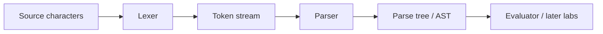
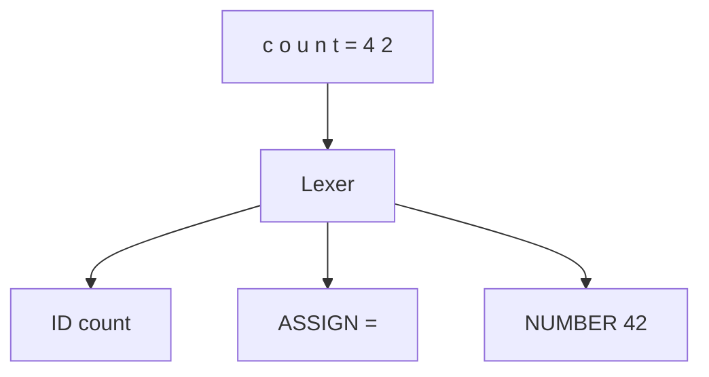
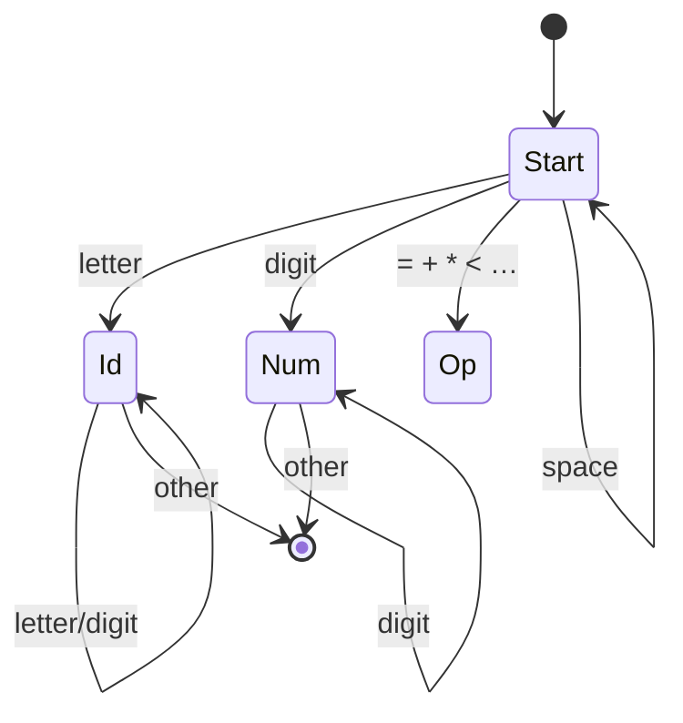
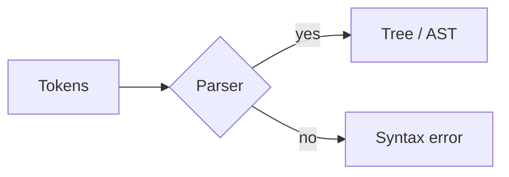
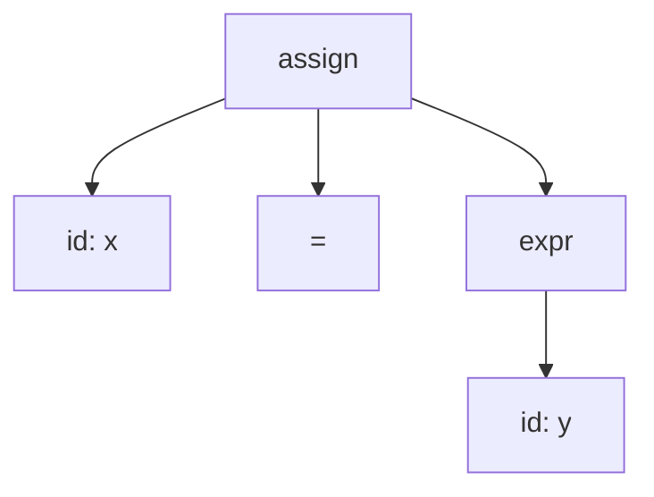
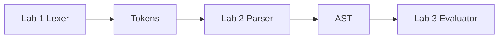

# Programming Languages
## Week 3 — Part 2: Lexical Analysis & Recursive-Descent Parsing

Sebesta, Section 4.1-4.4

---

# Today (Part 2)

1. The front end of a language processor
2. Lexical analysis — characters → tokens (4.2)
3. The parsing problem (4.3)
4. Recursive-descent parsing (4.4)
5. Tie-in to **Lab 1** (lexer)

**Skip for now:** Section 4.5 bottom-up parsing

---

# Where this fits

| Piece | Job |
| --- | --- |
| Week 2 | BNF describes **legal shapes** |
| Week 3 Part 1 | Semantics — what programs **mean** |
| Week 3 Part 2 | How tools **recognize** tokens and structure |
| Lab 1 | You build the **lexer** |
| Lab 2 | You build the **parser** → AST |

---

# The pipeline (again)



Today: **Lexer** in depth, **Parser** idea (recursive descent).

---

# Why split lexer and parser?

| If everything were one big pass… | Split into two |
| --- | --- |
| Messy: spaces, comments, `==` vs `=` | Lexer handles “words” |
| Grammar rules talk about `id`, not letters | Parser talks about tokens |
| Harder to debug | Clear stages — Lab 1 then Lab 2 |

**Lexer** = “what are the words?”  
**Parser** = “do the words form a sentence?”

---

# Section 4.1 — Introduction

**Syntax analysis** usually has two phases:

1. **Lexical analysis** (scanning)
2. **Syntax analysis** (parsing)

Together they are the **front end** before semantic analysis / code gen / interpretation.

---

# Lexeme vs token (review)

| Term | Meaning | Example |
| --- | --- | --- |
| **Lexeme** | Actual characters in the source | `while`, `count`, `42`, `+=` |
| **Token** | Category (+ often the lexeme) | `KEYWORD`, `ID`, `NUMBER`, `OP` |

```
Source:   while count < 10
Tokens:   KEYWORD(while)  ID(count)  OP(<)  NUMBER(10)
```

---

# Section 4.2 — Lexical analysis

**Input:** character stream  
**Output:** token stream  
**Also:** skip whitespace and comments (usually)



---

# What a lexer typically recognizes

| Pattern | Token kind |
| --- | --- |
| letters / digits for names | `id` |
| digit sequences | `number` |
| keywords (`if`, `then`, `while`) | keyword tokens *(special ids)* |
| operators (`+`, `*`, `==`, `=`) | operator tokens |
| punctuation `( ) , ;` | delimiter tokens |

Keywords are usually **reserved ids** — longest match / lookup table.

---

# Longest match (important)

Source: `x<=y`

| Wrong | Right |
| --- | --- |
| `<` then `=` as two tokens | `<=` as **one** token |

Rule of thumb: take the **longest** lexeme that matches a pattern.

Same idea: `==` vs `=`, `++` vs `+`.

---

# Skipping noise

Usually **not** tokens:

- Spaces, tabs, newlines (unless language is whitespace-sensitive)
- Comments (`// …`, `/* … */`)

Lexer eats them and keeps going.

---

# Hand-written lexer — state machine idea



Read one character at a time; change state; emit a token when a pattern finishes.

---

# Tiny lexer walkthrough

Source: `sum=10`

| Step | Chars seen | Action |
| --- | --- | --- |
| 1 | `s`…`m` | build id → token `ID(sum)` |
| 2 | `=` | token `ASSIGN` |
| 3 | `1`,`0` | build number → token `NUMBER(10)` |
| 4 | EOF | done |

No spaces needed — lexer still finds three tokens.

---

# Token design for Lab 1

Decide a small set of kinds, for example:

```
ID, NUMBER,
PLUS, MINUS, STAR, SLASH,
ASSIGN, LPAREN, RPAREN,
IF, THEN, ELSE, WHILE, PRINT,
EOF
```

Each token: **kind** + **lexeme** + (optional) **line/column** for errors.

---

# Keywords vs identifiers

Algorithm many lexers use:

1. Read a word that looks like an `id`
2. Look it up in a **keyword table**
3. If found → keyword token (`IF`)
4. Else → `ID`

```
if    → IF
iffy  → ID(iffy)
```

---

# Section 4.3 — The parsing problem

**Given:** token stream + grammar  
**Decide:** is the stream a **legal sentence**?  
**Usually also:** build a **parse tree** or **AST**



---

# Top-down vs bottom-up (one slide)

| Style | Idea | Course focus |
| --- | --- | --- |
| **Top-down** | Start at start symbol; expand toward tokens | Recursive descent (4.4) |
| **Bottom-up** | Start at tokens; reduce toward start symbol | Skip 4.5 for now |

Lab 2 will be **top-down** (hand-written recursive descent).

---

# Top-down picture

Grammar start: `<assign>`

```
<assign> → id = <expr>
```

Tokens: `ID(x)  ASSIGN  ID(y)`



Build the tree **from the root down**, consuming tokens left to right.

---

# LL and lookahead (light)

Many top-down parsers are **LL**:

- **L**eft-to-right scan of input
- **L**eftmost derivation
- Often need **1 token of lookahead** (“LL(1)”)

You peek at the **next token** to decide which grammar alternative to use.

---

# Left recursion is a problem for top-down

```
<expr> → <expr> + <term> | <term>
```

A naive recursive-descent function for `<expr>` would call itself **forever** before reading input.

| BNF style | Top-down friendly? |
| --- | --- |
| Left recursive | No — rewrite or use a loop |
| Right recursive / EBNF `{ }` | Yes |

---

# Fix — use EBNF repetition (preview for Lab 2)

Left recursive:

```
<expr> → <expr> + <term> | <term>
```

EBNF equivalent (same language, left-assoc in the parser loop):

```
<expr> → <term> { + <term> }
```

Implement with a **while** loop, not left recursion.

---

# Section 4.4 — Recursive-descent parsing

**Idea:** one function (or method) per nonterminal.

| Nonterminal | Function |
| --- | --- |
| `<program>` | `program()` |
| `<stmt>` | `stmt()` |
| `<expr>` | `expr()` |
| `<term>` | `term()` |

Each function:

1. Looks at the **current token**
2. Matches terminals with `match(…)`
3. Calls other functions for nonterminals

---

# match() helper

```
match(expected):
  if current_token == expected:
    advance to next token
  else:
    syntax error
```

Terminals are consumed by `match`.  
Nonterminals are handled by calling their function.

---

# Side by side — grammar ↔ code shape

| Grammar | Recursive-descent sketch |
| --- | --- |
| `<assign> → id = <expr>` | `match(ID); match(ASSIGN); expr();` |
| `<expr> → <term> { + <term> }` | `term(); while PLUS: match(PLUS); term()` |
| `<term> → id \| number` | `if ID: match(ID) else match(NUMBER)` |

This is Lab 2 — **not** Lab 1. Lab 1 stops at tokens.

---

# Mini example — parse `x = y`

Grammar:

```
<assign> → id = <expr>
<expr>   → id
```

| Step | Function | Current token | Action |
| --- | --- | --- | --- |
| 1 | `assign()` | `ID(x)` | `match(ID)` |
| 2 | | `ASSIGN` | `match(ASSIGN)` |
| 3 | `expr()` | `ID(y)` | `match(ID)` |
| 4 | | `EOF` | success |

---

# Choice with lookahead

```
<stmt> → <assign> | print id
```

| Next token | Call |
| --- | --- |
| `ID` | `assign()` |
| `PRINT` | `match(PRINT); match(ID)` |
| anything else | error |

One token of lookahead decides the alternative.

---

# Syntax errors

Good parsers:

- Report **what** was wrong
- Report **where** (line / column from the lexer)
- Ideally recover — for TinyLang, **fail clearly** is enough

```
Expected '=' after identifier, found '+' at line 3
```

Lab 1: store line numbers on tokens so Lab 2 can do this.

---

# Ambiguous grammars and parsers

A hand-written recursive-descent parser **implements one strategy**.

If the grammar is ambiguous, your code quietly picks **one** tree — or gets stuck.

**Fix the grammar first** (Week 2), then code the parser (Lab 2).

---

# Lab 1 — what you build

**Lexer only**

| Input | Output |
| --- | --- |
| Source string / file | List of tokens |

Must handle at least:

- identifiers and keywords
- numbers
- operators and punctuation your TinyLang needs
- skip whitespace (and comments if you want)

**Not** required yet: parse trees, ASTs, evaluation.

---

# Lab 1 checklist

1. Define a `Token` type (`kind`, `lexeme`, `line`, …)
2. Scan characters left to right
3. Emit tokens with **longest match**
4. Map keyword spellings → keyword kinds
5. End with `EOF`
6. Tests: a few TinyLang snippets → expected token lists

Starter code (if provided) will be Python, Java, or C++.

---

# From Lab 1 → Lab 2



Get tokens right and Lab 2 is much easier.

---

# Common lexer bugs

| Bug | Symptom |
| --- | --- |
| Not longest match | `<=` becomes `<` then `=` |
| Keywords not reserved | `if` tokenized as `ID` |
| Off-by-one on EOF | crash or missing last token |
| Forgetting to skip spaces | `ID` includes trailing space / next char |
| `=` vs `==` confusion | wrong token kinds |

---

# Week 3 Part 2 wrap

You can now:

- Explain **lexeme vs token**
- Describe what a **lexer** does (and skips)
- State the **parsing problem**
- Outline **recursive-descent** (one function per nonterminal)
- See how Lab 1 feeds Lab 2

---

# Before next class

**Lab 1 due:** end of Week 3 (lexer)

**Read next:** Chapter 5 — names, bindings, scopes

**Later:** Lab 2 turns your tokens into an AST

---

# Quick check prompts

1. What is the difference between a lexeme and a token?
2. Why is left recursion bad for recursive descent?
3. How does a lexer usually tell `if` from `iffy`?
4. For Lab 1, what should your output be — a tree or a token list?
