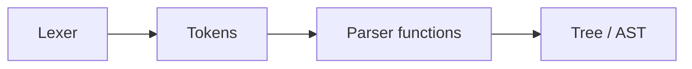
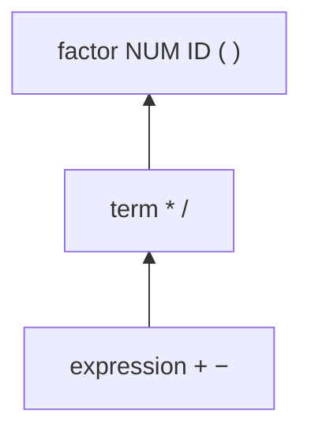
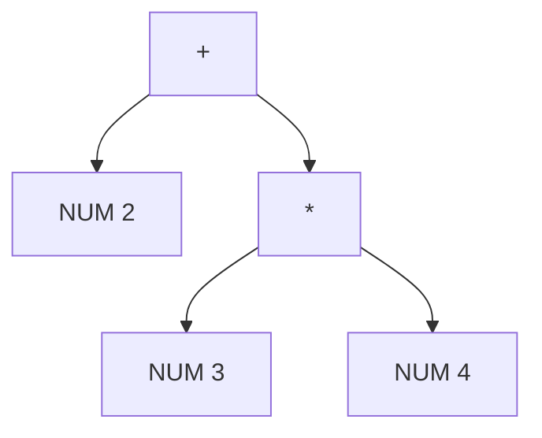

# Programming Languages

## Week 3 — Part 3: Recursive-Descent Parsing (Deep Dive)

Sebesta, Section 4.4 — with implementation detail for Lab 2

---

# Today (Part 3)

1. One function per grammar rule
2. Tokens as labeled lexemes
3. Expression grammar with precedence
4. A working recursive-descent parser
5. **Problem 1:** common prefixes → lookahead / left factoring
6. **Problem 2:** left recursion → loops that keep left associativity

---

# Where this fits


| Part    | Focus                         |
| ------- | ----------------------------- |
| 3.1     | Semantics (meaning)           |
| 3.2     | Lexer + parsing overview      |
| **3.3** | Recursive descent **in code** |
| Lab 1   | Tokens                        |
| Lab 2   | This style of parser → AST    |


---

# The big idea

A recursive-descent parser usually has **one function per grammar rule**.

It reads a stream of **labeled lexemes** from the lexer — not raw characters.




---

# Example token stream

```python
tokens = [
    ("ID", "x"),
    ("ASSIGN", "="),
    ("NUM", "2"),
    ("PLUS", "+"),
    ("NUM", "3"),
    ("MULTIPLY", "*"),
    ("NUM", "4"),
    ("SEMICOLON", ";")
]
```

Represents:

```text
x = 2 + 3 * 4;
```

Each tuple: `(token type, actual lexeme)`

---

# Expression grammar (with precedence)

```text
program    → statement*

statement  → assignment
           | expression SEMICOLON

assignment → ID ASSIGN expression SEMICOLON

expression → term { (PLUS | MINUS) term }

term       → factor { (MULTIPLY | DIVIDE) factor }

factor     → NUM
           | ID
           | LPAREN expression RPAREN
```

---

# Why the levels?


| Nonterminal  | Operators           | Precedence |
| ------------ | ------------------- | ---------- |
| `expression` | `+` `-`             | lower      |
| `term`       | `*` `/`             | higher     |
| `factor`     | numbers, ids, `(…)` | tightest   |


`expression` calls `term` **before** handling `+` / `-`  
→ multiplication and division are parsed first.

---

# Precedence picture




Same layering idea as Week 2 BNF — now as **functions that call each other**.

---

# Parser skeleton

```python
class Parser:
    def __init__(self, tokens):
        self.tokens = tokens
        self.position = 0
```

`position` = index of the **current** token.

---

# Helpers — look at tokens

```python
def current_type(self):
    if self.position >= len(self.tokens):
        return "EOF"
    return self.tokens[self.position][0]

def peek_type(self, offset):
    position = self.position + offset
    if position >= len(self.tokens):
        return "EOF"
    return self.tokens[position][0]
```

`peek_type(1)` = lookahead of one token.

---

# Helpers — consume

```python
def consume(self, expected_type):
    if self.current_type() != expected_type:
        raise SyntaxError(
            f"Expected {expected_type}, "
            f"but found {self.current_type()}"
        )
    token = self.tokens[self.position]
    self.position += 1
    return token
```

Match a terminal, advance, return the token.  
Wrong token → **syntax error**.

---

# program → statement*

```python
def parse_program(self):
    statements = []
    while self.current_type() != "EOF":
        statements.append(self.parse_statement())
    return ("PROGRAM", statements)
```

`*` in the grammar → `**while` loop** in the parser.

---

# statement — need lookahead

```text
statement → assignment | expression SEMICOLON
```

Assignment also starts with `ID`… so does an expression like `x + 1`.

```python
def parse_statement(self):
    if (
        self.current_type() == "ID"
        and self.peek_type(1) == "ASSIGN"
    ):
        return self.parse_assignment()

    expression = self.parse_expression()
    self.consume("SEMICOLON")
    return ("EXPRESSION_STATEMENT", expression)
```

`ID` + `ASSIGN` → assignment. Otherwise → expression statement.

---

# assignment

```text
assignment → ID ASSIGN expression SEMICOLON
```

```python
def parse_assignment(self):
    name = self.consume("ID")[1]
    self.consume("ASSIGN")
    value = self.parse_expression()
    self.consume("SEMICOLON")
    return ("ASSIGN", name, value)
```

Build a small tree node: `("ASSIGN", name, value)`.

---

# expression — loop, not left recursion

```text
expression → term { (PLUS | MINUS) term }
```

```python
def parse_expression(self):
    left = self.parse_term()

    while self.current_type() in ("PLUS", "MINUS"):
        operator = self.consume(self.current_type())[1]
        right = self.parse_term()
        left = (operator, left, right)

    return left
```

`{ … }` → **while**. Each pass folds another operator into `left`.

---

# term — same pattern, higher precedence

```text
term → factor { (MULTIPLY | DIVIDE) factor }
```

```python
def parse_term(self):
    left = self.parse_factor()

    while self.current_type() in ("MULTIPLY", "DIVIDE"):
        operator = self.consume(self.current_type())[1]
        right = self.parse_factor()
        left = (operator, left, right)

    return left
```

---

# factor — the atoms

```text
factor → NUM | ID | LPAREN expression RPAREN
```

```python
def parse_factor(self):
    if self.current_type() == "NUM":
        value = self.consume("NUM")[1]
        return ("NUM", int(value))

    if self.current_type() == "ID":
        name = self.consume("ID")[1]
        return ("ID", name)

    if self.current_type() == "LPAREN":
        self.consume("LPAREN")
        value = self.parse_expression()
        self.consume("RPAREN")
        return value

    raise SyntaxError(
        f"Expected NUM, ID, or LPAREN, "
        f"but found {self.current_type()}"
    )
```

Parentheses call **back up** to `expression` — that is the recursion that is OK.

---

# Run it

```python
tokens = [
    ("ID", "x"), ("ASSIGN", "="),
    ("NUM", "2"), ("PLUS", "+"),
    ("NUM", "3"), ("MULTIPLY", "*"),
    ("NUM", "4"), ("SEMICOLON", ";")
]

parser = Parser(tokens)
tree = parser.parse_program()
print(tree)
```

---

# Resulting expression tree

Important part of the tree:

```text
("+",
    ("NUM", 2),
    ("*",
        ("NUM", 3),
        ("NUM", 4)
    )
)
```

Means:

```text
2 + (3 * 4)
```

Precedence worked — `*` is under `+`.

---

# Tree picture




---

# Two problems that break recursive descent


| Problem             | Symptom                               |
| ------------------- | ------------------------------------- |
| **Common prefixes** | Wrong branch / need to rewind         |
| **Left recursion**  | Infinite recursion / `RecursionError` |


Fix the **grammar shape** (or use lookahead) — do not hope backtracking will save you forever.

---

# Problem 1 — Common prefixes

```text
statement → ID ASSIGN expression SEMICOLON
          | ID PLUS expression SEMICOLON
          | ID SEMICOLON
```

Every alternative begins with `ID`.

When the parser sees an identifier, it **cannot** tell which rule to use yet.

---

# What goes wrong

Input:

```text
x + 2;
```

A parser that “tries assignment first”:

1. Consume `x` as `ID`
2. Expect `ASSIGN`
3. Find `PLUS`
4. Discover wrong branch
5. **Rewind** and try again

That is **backtracking**.

---

# Backtracking (works, but painful)

```python
starting_position = self.position

try:
    return self.parse_assignment()
except SyntaxError:
    self.position = starting_position
    return self.parse_expression_statement()
```


| Pros            | Cons                     |
| --------------- | ------------------------ |
| Easy to slap on | Slow on bad input        |
|                 | Hard to debug            |
|                 | Error messages get muddy |


Prefer: **lookahead** or **left factoring**.

---

# Fix 1 — Lookahead

If two tokens decide the branch, peek first:

```python
def parse_statement(self):
    if (
        self.current_type() == "ID"
        and self.peek_type(1) == "ASSIGN"
    ):
        return self.parse_assignment()

    expression = self.parse_expression()
    self.consume("SEMICOLON")
    return ("EXPRESSION_STATEMENT", expression)
```

---

# Lookahead decision table


| Tokens seen    | Choice     |
| -------------- | ---------- |
| `ID ASSIGN`    | assignment |
| `ID PLUS`      | expression |
| `ID MULTIPLY`  | expression |
| `ID SEMICOLON` | expression |


No rewind — decide **before** consuming the wrong path.

---

# Fix 2 — Left-factor the grammar

Original (shared `ID`):

```text
statement → ID ASSIGN expression SEMICOLON
          | ID PLUS expression SEMICOLON
          | ID SEMICOLON
```

Left-factored:

```text
statement → ID statement_tail

statement_tail → ASSIGN expression SEMICOLON
               | PLUS expression SEMICOLON
               | SEMICOLON
```

Consume the common `ID` **once**.

---

# Left-factored code

```python
def parse_statement(self):
    name = self.consume("ID")[1]
    return self.parse_statement_tail(name)

def parse_statement_tail(self, name):
    if self.current_type() == "ASSIGN":
        self.consume("ASSIGN")
        value = self.parse_expression()
        self.consume("SEMICOLON")
        return ("ASSIGN", name, value)

    if self.current_type() == "PLUS":
        self.consume("PLUS")
        right = self.parse_expression()
        self.consume("SEMICOLON")
        return ("+", ("ID", name), right)

    if self.current_type() == "SEMICOLON":
        self.consume("SEMICOLON")
        return ("ID", name)

    raise SyntaxError("Invalid statement")
```

---

# Left factoring — general pattern

```text
A → αβ | αγ
```

Factor out shared `α`:

```text
A  → α A'
A' → β | γ
```


| Before                        | After                            |
| ----------------------------- | -------------------------------- |
| Two rules that start the same | One shared prefix, then a choice |


---

# Problem 2 — Left recursion

Classic grammar:

```text
expression → expression PLUS term
           | expression MINUS term
           | term
```

`expression` appears **first** on the right-hand side → **left-recursive**.

---

# Naive code blows up

```python
def parse_expression(self):
    left = self.parse_expression()  # never consumes a token!
    self.consume("PLUS")
    right = self.parse_term()
    return ("+", left, right)
```

```text
parse_expression()
  → parse_expression()
      → parse_expression()
          → …
```

Python:

```text
RecursionError: maximum recursion depth exceeded
```

Backtracking **cannot** help — you never get to try another branch.

---

# Fix — remove left recursion

Start with:

```text
expression → expression PLUS term | term
```

Rewrite:

```text
expression      → term expression_tail

expression_tail → PLUS term expression_tail
                | ε
```

`ε` = produce nothing (end the chain).

---

# Same idea in EBNF

```text
expression → term { PLUS term }
```

`{ … }` = zero or more → implement with a **loop**.

```python
def parse_expression(self):
    left = self.parse_term()

    while self.current_type() == "PLUS":
        self.consume("PLUS")
        right = self.parse_term()
        left = ("+", left, right)

    return left
```

---

# Left associativity preserved

Input: `2 + 3 + 4`

Loop builds:

```text
("+",
    ("+",
        ("NUM", 2),
        ("NUM", 3)
    ),
    ("NUM", 4)
)
```

Means:

```text
(2 + 3) + 4
```

Left-assoc — same as the original left-recursive grammar intended.

---

# General left-recursion transform

```text
A → A α | β
```

becomes:

```text
A  → β A'
A' → α A' | ε
```

EBNF:

```text
A → β { α }
```

For operators: `**while` loop**, fold into `left`.

---

# Why not just use right recursion?

Tempting rewrite:

```text
expression → term MINUS expression | term
```

Stops infinite recursion — but **changes meaning**.

---

# Associativity matters

`10 - 3 - 2`


| Style                                | Grouping       | Value |
| ------------------------------------ | -------------- | ----- |
| Left-assoc (loop / left-rec grammar) | `(10 - 3) - 2` | **5** |
| Right-assoc (right recursion)        | `10 - (3 - 2)` | **9** |


Use the **loop** fix: no left recursion, **keep** left associativity.

---

# Side by side — wrong vs right rewrite


| Approach                     | Safe for `-`?           |
| ---------------------------- | ----------------------- |
| Left recursive function      | No — stack overflow     |
| Right recursive grammar      | Parses, **wrong** assoc |
| `term { MINUS term }` + loop | Yes — left-assoc        |


---

# Summary table


| Problem        | Example                   | Result                   | Fix                      |
| -------------- | ------------------------- | ------------------------ | ------------------------ |
| Common prefix  | `ID ASSIGN … | ID PLUS …` | Wrong branch / backtrack | Lookahead or left factor |
| Left recursion | `expr → expr PLUS term`   | Infinite recursion       | `{ }` + loop             |


---

# Grammar that plays nice with recursive descent

```text
expression → term { (PLUS | MINUS) term }

term → factor { (MULTIPLY | DIVIDE) factor }

factor → NUM
       | ID
       | LPAREN expression RPAREN
```

This grammar:

- works with recursive descent
- avoids left recursion
- keeps **left** associativity
- implements **precedence** via layers
- branches only when the next token identifies the alternative

---

# Lab 2 takeaways

1. One function ≈ one nonterminal
2. `consume` terminals; call functions for nonterminals
3. Prefer **lookahead** over backtracking
4. Never code left recursion directly — use a loop
5. Build a tree (tuples / AST nodes) as you go

---

# Quick check

1. Why does `peek_type(1)` help for `x = 1;` vs `x + 1;`?
2. What does `{ PLUS term }` become in Python?
3. Why is right recursion a bad “fix” for `a - b - c`?
4. Draw the tree your parser should build for `2 + 3 * 4`.

