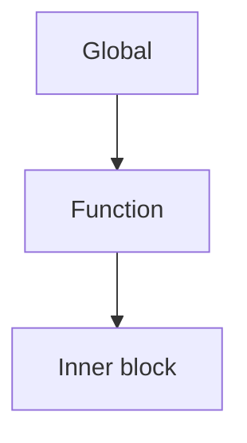

# Programming Languages
## Week 4 — Names, Bindings, and Scopes

Sebesta, Chapter 5

---

# Today

1. Names
2. Variables (the six attributes)
3. Binding and binding times
4. Type bindings — static vs dynamic
5. Storage bindings and lifetime
6. Scope — static vs dynamic
7. Scope vs lifetime
8. Referencing environments
9. Named constants

---

# Where this fits

| Week | Focus |
| --- | --- |
| 2–3 | Shape of programs (syntax, tokens, trees) |
| **4** | What **names** mean and where they are visible |
| 5+ | Types, expressions, control, … |
| Lab 3 | Environments = implementing **bindings** |

---

# Why this chapter matters

Almost every bug students hit eventually involves:

| Symptom | Often really about… |
| --- | --- |
| “Wrong value” | Binding / which variable |
| “Undefined” | Scope / lifetime |
| “Works in one language, not another” | Different binding rules |

Learn the vocabulary → debug across languages.

---

# Section 5.2 — Names

A **name** is a string that identifies an entity (variable, function, type, …).

Design issues (Sebesta):

| Issue | Question |
| --- | --- |
| Length | How long can names be? |
| Connectors | `_` allowed? `-`? |
| Case | Is `Foo` the same as `foo`? |
| Special words | Reserved? Keywords? Predefined? |

---

# Name design — languages

| Feature | Languages (examples) |
| --- | --- |
| Case-sensitive | C, C++, Java, C#, Python, JavaScript, Rust, Swift, Go |
| Case-insensitive | Fortran (historically), Basic (many dialects), Pascal (classic), SQL (usually) |
| Significant `_` | C-family, Python, Java, Rust |
| Significant `-` in names | Lisp/Scheme (idiomatic), COBOL, some scripting |
| Very long / unlimited names | Most modern languages |
| Short historic limits | Early Fortran (6 chars), early Basic |

---

# Special words

| Kind | Meaning | Examples |
| --- | --- | --- |
| **Reserved word** | Cannot be used as a name | `if`, `class` in Java |
| **Keyword** | Special in context; may be reusable | Fortran historically; some uses of `kind` in modern langs |
| **Predefined name** | Built-in but often redefinable | `print` in Python (can shadow) |

---

# Special words — languages

| Approach | Languages |
| --- | --- |
| Large reserved-word set | Java, C#, C++, JavaScript, Rust |
| Fewer reserved words; context keywords | C# (some contextual), Kotlin, Swift |
| Predefined that you *can* redefine | Python (`list`, `id` — allowed but unwise) |
| Heavy use of punctuation / few keywords | Lisp/Scheme, Forth |

---

# Section 5.3 — Variables

A variable is a binding of a **name** to a memory cell (abstraction).

Sebesta’s six attributes:

| Attribute | Meaning |
| --- | --- |
| **Name** | Identifier (optional for anonymous temps) |
| **Address** | Memory location (l-value) |
| **Value** | Contents (r-value) |
| **Type** | Range of values + operations |
| **Lifetime** | Time the variable is bound to storage |
| **Scope** | Where the name is visible |

---

# Address vs value (l-value / r-value)

| Term | Means | Example |
| --- | --- | --- |
| **l-value** | Location that can be assigned to | left side of `x = …` |
| **r-value** | Value for reading / computing | right side of `… = x + 1` |

| Language notes | |
| --- | --- |
| C / C++ | Explicit addresses via `&`, pointers |
| Java / C# / Python | References for objects; no raw addresses in safe code |
| Rust | Ownership / borrows instead of naked pointers |

---

# Aliases

**Alias** = two or more names for the **same** memory cell.

| How aliases arise | Languages |
| --- | --- |
| Pointers / references | C, C++, Rust (refs), Go |
| `union` / overlapping storage | C, C++ |
| Pass-by-reference parameters | C++, Fortran, Pascal, C# (`ref`) |
| Object references | Java, Python, JavaScript, C# |
| Fortran `EQUIVALENCE` (historic) | Fortran |

Aliases hurt **reliability** and **readability** — hard to know what changed.

---

# Section 5.4 — Binding

A **binding** is an association between an attribute and an entity.

Examples:

| Binding | Example |
| --- | --- |
| Name → variable | `count` means this cell |
| Variable → type | `count` is `int` |
| Variable → storage | stack slot at runtime |
| Operator → operation | `*` means multiply (or overload) |

---

# Binding times

**When** does the binding happen?

| Binding time | What gets decided | Examples |
| --- | --- | --- |
| **Language design** | `*` means multiply | Almost all languages |
| **Language implementation** | `int` size (sometimes) | C `int` historically |
| **Compile time** | Variable’s type (static typing) | Java, C#, C++, Rust, Go, Swift |
| **Load time** | Static variable’s address | C `static`, Fortran COMMON |
| **Link time** | Call to library function | C linking `printf` |
| **Runtime** | Variable’s value; dynamic types | Assignments; Python/JS types |

---

# Static vs dynamic bindings

| | **Static binding** | **Dynamic binding** |
| --- | --- | --- |
| When | Before runtime (or first fixed, then stable) | During execution; can change |
| Example | Java variable type | Python variable type |
| Benefit | Earlier error detection | Flexibility |
| Cost | Less flexible | More runtime checking / surprises |

---

# Type bindings — static typing

Type bound **before** runtime (usually at compile / declaration).

| Language | Notes |
| --- | --- |
| Java | Explicit types; `var` local inference (recent) |
| C / C++ | Declarations; `auto` in modern C++ |
| C# | Explicit or `var` inference |
| Rust | Strong static; heavy inference |
| Go | Static; `:=` infers |
| Swift / Kotlin | Static; inference common |
| Haskell / ML / F# | Static; inference-first |
| TypeScript | Static layer on JavaScript |

---

# Type bindings — dynamic typing

Type bound by **assignment**; can change during execution.

| Language | Notes |
| --- | --- |
| Python | Name can hold int, then string later |
| JavaScript / Ruby / Lua | Dynamic |
| Lisp / Scheme | Dynamic (with optional typed dialects) |
| Matlab / R | Dynamic / vectorized flavors |
| PHP | Dynamic (with optional types in newer versions) |

---

# Explicit vs implicit type declaration

| Style | Meaning | Languages |
| --- | --- | --- |
| **Explicit** | Programmer states the type | Java, C, C++, C#, Go (often) |
| **Implicit** | Type inferred or defaulted | Python, JS; also Fortran historically; ML/Haskell inference |
| **Mixed** | Inference available | C++ `auto`, Java `var`, C# `var`, Rust, Swift, Kotlin |

---

# Static type checking vs dynamic type checking

| | Static checking | Dynamic checking |
| --- | --- | --- |
| When | Compile time | Runtime |
| Catches | Many type errors before run | Type errors when path executes |
| Languages | Java, C#, Rust, Go, Haskell, C++ (mostly) | Python, JS, Ruby, Lisp |
| Hybrid | TypeScript, Python + type checkers (mypy), PHP typed modes | |

---

# Section 5.4–5.5 — Storage bindings & lifetime

**Lifetime** = time during which a variable is bound to a specific memory cell.

| Category | Lifetime | Typical languages / features |
| --- | --- | --- |
| **Static** | Entire program run | C `static`, Fortran SAVE, global data |
| **Stack-dynamic** | From elaboration to end of scope / call | Locals in C, Java, Python, C#, Rust |
| **Explicit heap-dynamic** | Allocated / freed by programmer or GC | `new` / `malloc`; objects in Java/C#/Python |
| **Implicit heap-dynamic** | Bound on assignment; heap under the hood | Python names; JS objects; Perl/PHP scalars historically |

---

# Static variables

| Pros | Cons |
| --- | --- |
| Fast addressing | No recursion for that storage |
| History-sensitive (keeps value) | Less flexible memory use |

| Languages / features |
| --- |
| C / C++ `static` locals and file-scope |
| Java `static` fields |
| C# `static` fields |
| Fortran SAVE / DATA |

---

# Stack-dynamic variables

Allocated on the **call stack** when a declaration / frame is entered.

| Pros | Cons |
| --- | --- |
| Supports recursion | Slightly slower than static |
| Shared memory across calls | No “history” after return (unless static) |

| Languages |
| --- |
| Default locals: C, C++, Java, C#, Python, JS (locals), Rust, Go, Swift |

---

# Heap-dynamic variables

| Style | Who manages memory? | Languages |
| --- | --- | --- |
| Explicit allocate/free | Programmer | C `malloc`/`free`, C++ `new`/`delete` |
| Garbage-collected objects | Runtime GC | Java, C#, Python, JS, Go, Ruby, Lisp |
| Ownership / RAII | Compiler + destructors | Rust, modern C++ |

---

# Lifetime vs scope (preview)

| | Lifetime | Scope |
| --- | --- | --- |
| About | How long storage exists | Where the **name** is visible |
| Can differ? | Yes | e.g. static local: long lifetime, small scope |

---

# Section 5.5 — Scope

**Scope** of a binding = the region of the program where that binding is active / visible.

| Kind | Decision time | How name is found |
| --- | --- | --- |
| **Static (lexical) scope** | Compile / text structure | Look in enclosing blocks in the source |
| **Dynamic scope** | Runtime | Look in the calling chain |

---

# Static (lexical) scope

“Where you **wrote** the name decides what it means.”



Search: innermost block → enclosing → … → global.

---

# Static scope — languages

| Languages with static / lexical scope |
| --- |
| C, C++, Java, C#, Python, JavaScript (lexical), Rust, Go, Swift, Kotlin |
| Scheme, Haskell, ML, F#, Common Lisp *(lexical by default)* |
| Almost all mainstream languages today |

Nested functions / closures make lexical scope especially visible: JavaScript, Python, Scheme, ML, Rust closures.

---

# Blocks and nested scopes

| Feature | Languages |
| --- | --- |
| Block scope `{ }` | C, C++, Java, C#, Rust, Go, JS (`let`/`const`) |
| Function scope for `var` | JavaScript (`var` is function-scoped — gotcha) |
| Indentation / suite scope | Python |
| Nested functions | Python, JS, Scheme, Pascal, Ada, modern C++ (lambdas) |
| No nested functions | Classic C, Java (until lambdas; still no true nested named defs like Pascal) |

---

# Dynamic scope

“Where you **called** from decides what a free name means.”

Search: current function → caller → caller’s caller → …

| Languages / systems with dynamic scope |
| --- |
| Early Lisp dialects |
| Perl (optional: `local`) |
| Bash / shell variables (often dynamic-flavored) |
| Emacs Lisp (historically dynamic; lexical available now) |
| Some early APL / Snobol discussions in textbooks |

Rare as the **default** in modern general-purpose languages.

---

# Static vs dynamic — same code, different meaning

```text
x = 1
function big()
  x = 2
  function sub()
    print x
  sub()
big()
```

| Scope rule | `print x` sees | Typical languages |
| --- | --- | --- |
| Static | `x` from `big` if nested lexically; else global — depends on nesting | Python / JS with nested defs |
| Dynamic | `x` from whoever called `sub` | Classic dynamic Lisp |

Tracing these is a favorite exam question.

---

# Global and nonlocal

| Term | Meaning |
| --- | --- |
| **Local** | Declared in this block / function |
| **Nonlocal** | Visible here but declared in an enclosing scope |
| **Global** | Declared at program / module top level |

| Language quirks |
| --- |
| Python: `global` / `nonlocal` keywords to assign out |
| JS: undeclared assign → accidental global (sloppy mode) |
| C: `extern` for cross-file globals |
| Java: `static` fields ≈ class-level “globals” |

---

# Declaration order

| Rule | Languages |
| --- | --- |
| Declare before use | C, C++, Pascal, Java (locals) |
| Hoisting / can use before textual declaration | JavaScript `function` declarations; some `var` behavior |
| Mutual recursion needs forward decl / prototypes | C, C++, Pascal |
| Names visible in whole block after binding | Python (but unbound until assignment runs — TDZ-like bugs) |
| Temporal dead zone | JS `let`/`const` |

---

# Section 5.6 — Scope and lifetime together

| Variable kind | Scope | Lifetime |
| --- | --- | --- |
| Local stack-dynamic | Function / block | While frame / block active |
| Static local | Function / block | Whole program |
| Global | Whole program / module | Whole program |
| Heap object | Via references in scope | Until unreachable / freed |

**Key exam idea:** scope ≠ lifetime.

---

# Examples — scope ≠ lifetime

| Situation | Scope | Lifetime | Languages |
| --- | --- | --- | --- |
| C `static` local | Local to function | Entire run | C, C++ |
| Java object field | Via object reference | Until GC | Java, C# |
| Closure captures local | Inner function’s free vars | May outlive the outer call | JS, Python, Scheme, Rust |
| Python default arg evaluated once | Function | Lives across calls | Python gotcha |

---

# Section 5.7 — Referencing environment

The **referencing environment** of a statement = all names visible there + their bindings.

| Scope rule | Referencing environment built from… |
| --- | --- |
| Static | Local + lexically enclosing scopes |
| Dynamic | Local + caller chain at runtime |

Closures **capture** a referencing environment for later.

---

# Closures — languages

| Language | Closures / lambdas |
| --- | --- |
| JavaScript | First-class; very common |
| Python | `lambda` / nested `def` |
| Scheme / Lisp | Native |
| Java | Lambdas (from 8); capture effectively-final |
| C# | Delegates / lambdas |
| C++ | Lambdas with capture lists |
| Rust | Closures with ownership rules |
| Go / Swift / Kotlin | Yes |

---

# Section 5.8 — Named constants

A **named constant** is bound to a value that cannot change (in the language’s model).

| Benefit | |
| --- | --- |
| Readability | `MAX_SIZE` vs `1024` |
| Reliability | Cannot assign by mistake |
| Compile-time folding | Sometimes |

---

# Named constants — languages

| Style | Languages / features |
| --- | --- |
| `const` | C, C++, JS, Rust, Swift |
| `final` | Java |
| `readonly` / `const` | C# |
| Convention only (`ALL_CAPS`) | Python (no true const in language) |
| `constexpr` / compile-time | Modern C++ |
| Enum constants | Java, C#, C, Rust, Swift |
| `val` vs `var` | Kotlin, Scala, Swift (`let`) |

---

# Dynamic vs static binding of constant value

| Binding of the constant’s value | Languages |
| --- | --- |
| Compile-time constant expression | C `const` (sometimes), Java `final` primitives, C# `const` |
| Runtime-initialized then frozen | Java `final` refs (object still mutable), JS `const`, Rust `let` |
| Truly immutable deep data | Harder — Rust ownership, persistent structures in FP |

`const` often means “this **binding** doesn’t change,” not “deep freeze.”

---

# Big comparison table

| Concept | Typical static-leaning | Typical dynamic-leaning |
| --- | --- | --- |
| Types | Java, C#, Rust, Go, Haskell | Python, JS, Ruby, Lisp |
| Scope | Almost everyone today | Early Lisp, some shells, Perl `local` |
| Locals’ storage | Stack-dynamic | Stack + heap objects |
| Constants | `const` / `final` / `let` | Conventions or soft binding |

---

# Tie-back to TinyLang / labs

| Interpreter piece | Chapter 5 idea |
| --- | --- |
| Environment / symbol table | Bindings of names → values |
| Nested scopes | Push/pop environments |
| Closures (stretch) | Capture referencing environment |
| Assignment | Rebind value attribute |
| `const` (stretch) | Reject reassignment |

Lab 3 is **operational** semantics for bindings.

---

# Tracing practice (do in class)

```text
x = 1
def outer():
    x = 2
    def inner():
        print(x)
    inner()
outer()
```

| Language / rule | What prints? |
| --- | --- |
| Python (lexical) | |
| If it were dynamic scope | |

Fill in during discussion.

---

# Week 4 wrap

You should be able to:

- List a variable’s attributes (name, address, value, type, lifetime, scope)
- Name **binding times** and give language examples
- Contrast static vs dynamic **typing** and **scope**
- Explain why **scope ≠ lifetime**
- Point to languages that illustrate each design choice

---

# Before next class

**Read:** Chapter 6 (focus Section 6.1-6.5, 6.10-6.15)

**Practice:** “What does this print?” in Python vs a static language; sketch environments

**Lab:** Keep lexer solid — Lab 2 parser uses names as `ID` tokens; Lab 3 binds them
