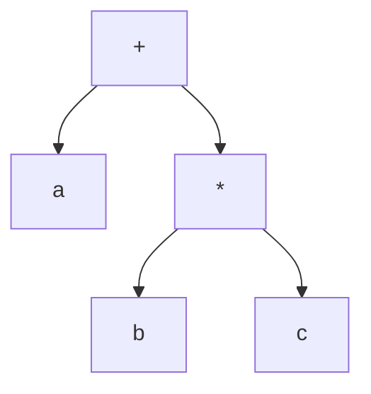

# Programming Languages
## Week 6 — Part 1: Expressions & Assignment Statements

Sebesta, Chapter 7

---

# Today (Part 1)

1. Why expressions matter
2. Arithmetic expressions — precedence, associativity, evaluation order
3. Side effects and referential transparency
4. Overloaded operators
5. Type conversions — coercion vs cast
6. Relational and Boolean expressions
7. Short-circuit evaluation
8. Assignment statements
9. Mixed-mode assignment

**Part 2 later:** Chapter 8 — selection, loops, `goto`, guarded commands

---

# Where this fits

| Week | Focus |
| --- | --- |
| 4 | Names and bindings |
| 5 | Types — what values **are** |
| **6 Part 1** | Expressions — how values get **computed** and **stored** |
| 6 Part 2 | Control — which statements run, and how often |
| 7 | Midterm (Weeks 1–6) |
| Lab 3 | Your evaluator makes **every** decision in this deck |

---

# Section 7.1 — Why expressions matter

- Expressions are **the** way to compute values in most languages
- To understand one, you need to know the **order** operators and operands are evaluated
- Imperative languages are built on **assignment**: compute a value, store it in a variable

Two programs with the same syntax can compute different answers if the evaluation rules differ.

---

# Section 7.2 — Arithmetic expressions

Built from **operators**, **operands**, parentheses, and function calls.

| Operator kind | Operands | Example |
| --- | --- | --- |
| Unary | 1 | `-x`, `not done` |
| Binary | 2 | `a + b` |
| Ternary | 3 | `c ? x : y` |

Most binary operators are **infix**. Lisp puts everything **prefix**: `(+ a (* b c))`.

---

# Design issues for arithmetic expressions

| Question | Example of the problem |
| --- | --- |
| Operator **precedence**? | Is `a + b * c` → `a + (b * c)`? |
| Operator **associativity**? | Is `a - b - c` → `(a - b) - c`? |
| Order of **operand** evaluation? | In `f() + g()`, which call runs first? |
| Operand evaluation **side effects**? | Does `g()` change a variable `f()` reads? |
| User-defined **overloading**? | Can I define `+` on my `Matrix` type? |
| **Type mixing**? | What is `2 + 3.5`? |

Every one of these is a decision **you** make in Lab 3.

---

# Precedence

Rules for which operator binds tighter when there are no parentheses.

| Typical level (high → low) | C-based | Python |
| --- | --- | --- |
| Exponent | — (no operator) | `**` |
| Unary | `++ -- - !` | `-x`, `not` (lower) |
| Multiplicative | `* / %` | `* / // %` |
| Additive | `+ -` | `+ -` |

```text
a + b * c     →   a + (b * c)
```

---

# Precedence surprise

In Python, `**` binds **tighter** than unary minus:

```python
>>> -2 ** 2
-4          # parsed as -(2 ** 2)
>>> (-2) ** 2
4
```

Math convention agrees with Python here. Many students expect `4`.

**APL** has **no** precedence at all: every operator has equal precedence and evaluates right to left.

---

# Associativity

When two operators have the **same** precedence, which one goes first?

| Rule | Example | Languages |
| --- | --- | --- |
| Left | `a - b - c` → `(a - b) - c` | Almost all, for `+ - * /` |
| Right | `2 ** 3 ** 2` → `2 ** (3 ** 2)` = 512 | Python, Ruby, Fortran `**` |
| Right | `a = b = c` → `a = (b = c)` | C-based assignment |
| Nonassociative | `A ** B ** C` is **illegal** | Ada — must parenthesize |

Your Lab 2 grammar already encodes this: left recursion (or `{ … }` loops) → left-assoc.

---

# Precedence and associativity live in the tree



`a + b * c` — higher-precedence operators end up **lower** in the AST, so they are evaluated first.

Parentheses override the rules, then disappear from the AST.

---

# Math vs machine arithmetic

On paper, `+` is associative. On a computer, **not always**.

```python
>>> (0.1 + 0.2) + 0.3
0.6000000000000001
>>> 0.1 + (0.2 + 0.3)
0.6
```

Integers can also differ: `(big + big) - big` may **overflow** where `big + (big - big)` does not.

Compilers are not free to reorder floating-point math.

---

# Conditional expressions

An `if` that **produces a value**:

| Language | Syntax |
| --- | --- |
| C, C++, Java, C#, JS | `avg = (count == 0) ? 0 : sum / count;` |
| Python | `avg = 0 if count == 0 else sum / count` |
| Ruby, Rust, Kotlin, Scala | `if` is already an expression |

Same idea, different syntax. Only **one** branch is evaluated.

---

# Operand evaluation order

Precedence says which **operator** applies first.  
It does **not** say which **operand** gets evaluated first.

```text
f() + g()
```

| Language | Rule |
| --- | --- |
| Java, C#, Python | Left to right — `f()` first |
| C, C++ | **Unspecified** — compiler decides |

Only matters when evaluating an operand has a **side effect**.

---

# Functional side effects

A **functional side effect** = a function changes a parameter or a nonlocal (global) variable.

```c
int a = 5;

int fun1() {
    a = 17;
    return 3;
}

void main() {
    a = a + fun1();    /* 8 or 20? */
}
```

| Operand order | Result |
| --- | --- |
| Read `a` first (5), then call | `5 + 3 = 8` |
| Call first (`a` becomes 17), then read `a` | `17 + 3 = 20` |

---

# Two fixes for side-effect ambiguity

| Fix | Cost |
| --- | --- |
| **Ban** functional side effects (no nonlocal writes, no out-params) | Lose flexibility; hard in imperative languages |
| **Fix** the evaluation order (Java: left to right) | Limits compiler optimizations that reorder code |

C/C++ chose neither — the programmer must avoid writing code like this.

---

# Referential transparency

A program is **referentially transparent** if any two expressions with the same value can be substituted for each other without changing the program.

```text
result1 = (fun(a) + b) / (fun(a) - c)
temp    = fun(a)
result2 = (temp + b) / (temp - c)
```

If `fun` has **no** side effects → `result1 == result2`.  
If `fun` changes `b` or `c` → the programs differ.

| Benefit | |
| --- | --- |
| Easier to reason about | Replace a call with its value |
| Easier to optimize | Compute once, reuse |

Pure functional languages (Haskell) are referentially transparent. Week 12 comes back to this.

---

# Section 7.3 — Overloaded operators

One operator symbol, **more than one meaning**.

| Common built-in overloads | |
| --- | --- |
| `+` | int add, float add, string concatenation (Java, Python, JS) |
| `-` | unary negation **and** binary subtraction |
| `*` | numeric multiply, Python `"ab" * 3` repetition |

Usually fine — the meanings are related.

---

# Overloading that hurts readability

C's `&` has **unrelated** meanings:

```c
x = &y;      /* address of y */
x = z & y;   /* bitwise AND  */
```

Drop `z` by accident and the program **still compiles** — with a completely different meaning.

C++ reuses `<<` for both bit shift and stream output (`cout << x`).

---

# User-defined operator overloading

| Allowed | Not allowed |
| --- | --- |
| C++ (`operator+`), C#, Python (`__add__`), Ruby, Kotlin, Swift | Java (only the built-in `+` on strings) |

```python
class Vec:
    def __init__(self, x, y):
        self.x, self.y = x, y
    def __add__(self, other):
        return Vec(self.x + other.x, self.y + other.y)

v = Vec(1, 2) + Vec(3, 4)    # calls Vec.__add__
```

In **Ruby**, every operator is a method: `a + b` is `a.+(b)`.

---

# Overloading — trade-off

| Pro | Con |
| --- | --- |
| `A * B + C` for matrices reads like math | Nothing stops `+` from meaning "delete file" |
| Library types feel built-in | Reader must know operand types to know meaning |

Java's designers left it out on purpose (readability over writability).

---

# Division — an overloading decision

| Language | `7 / 2` | Integer division |
| --- | --- | --- |
| C, C++, Java | `3` (int ÷ int → int) | same `/` |
| Python 3 | `3.5` | `7 // 2` → `3` |
| Pascal, Ada | — | `div` |

And negative numbers disagree too:

| Language | `-7` integer-divided by `2` |
| --- | --- |
| C99+, Java | `-3` (truncate toward zero) |
| Python `//` | `-4` (floor) |

Your Lab 3 language must pick one — and document it.

---

# Section 7.4 — Type conversions

| Kind | Direction | Example | Safe? |
| --- | --- | --- | --- |
| **Narrowing** | To a type that **can't** hold all values | `double` → `int` | Can lose data |
| **Widening** | To a type that holds at least an approximation | `int` → `double` | Usually safe |

Widening can still lose **precision**:

```text
int 16777217   →   float 16777216.0     (32-bit float has ~24 bits of mantissa)
```

---

# Mixed-mode expressions and coercion

A **mixed-mode expression** has operands of different types: `2 + 3.5`.

A **coercion** is an **implicit** conversion the language inserts for you.

```java
int a;
float b, c, d;
d = b * a;       // programmer meant b * c
```

Because `int` is coerced to `float`, this compiles. The typo is **not** caught.

**More coercion → fewer type errors detected.**

---

# Coercion across languages

| Language | `2 + 3.5` | Number + string |
| --- | --- | --- |
| Python | `5.5` | `TypeError` |
| Java | `5.5` | `"2" + 3` → `"23"` (concat) |
| JavaScript | `5.5` | `"5" + 1` → `"51"`, `"5" - 1` → `4` |
| ML, F#, OCaml | **type error** — convert explicitly | type error |
| Ada | **type error** (almost no coercion) | type error |

Java also coerces `byte` and `short` to `int` for arithmetic:

```java
byte x = b1 + b2;    // compile error: result is int
```

---

# Explicit conversions — casts

| Style | Languages |
| --- | --- |
| `(int) angle` | C, C++, Java, C# |
| `int(angle)`, `float(sum)` | Python, Go |
| `angle as i32` | Rust |
| `static_cast<int>(angle)` | C++ (preferred) |

Casts are **visible** in the source — the reader sees a conversion happen.

---

# Errors in expressions

| Cause | Example |
| --- | --- |
| Limits of arithmetic | Division by zero |
| Limits of computer arithmetic | Integer overflow, float underflow |

| Language | Integer overflow |
| --- | --- |
| C / C++ (signed) | Undefined behavior |
| Java | Silently wraps |
| Python | Never — ints grow |
| Rust | Panics in debug builds, wraps in release |

Usually run-time errors → exceptions (Chapter 14).

---

# Section 7.5 — Relational expressions

A **relational operator** compares two operands. The result is Boolean.

| Meaning | C-based | Ada | Lua | Fortran | SQL / Pascal |
| --- | --- | --- | --- | --- | --- |
| Not equal | `!=` | `/=` | `~=` | `.NE.` | `<>` |

Relational operators have **lower** precedence than arithmetic: `a + 1 > 2 * b` needs no parentheses.

---

# Two kinds of equality

JavaScript and PHP have both:

| Operator | Coerces? | `0 == ""` | `"1" == 1` |
| --- | --- | --- | --- |
| `==` | Yes | `true` | `true` |
| `===` | No | `false` | `false` |

Style guides say "always use `===`" — a sign that the coercion was a design mistake.

---

# Boolean expressions

Operators: `and`, `or`, `not` (and sometimes `xor`).

C89 had **no** Boolean type — `0` is false, nonzero is true. So this is legal C:

```c
if (a > b > c) ...
```

| Language | Meaning of `a > b > c` | With `a=3, b=2, c=1` |
| --- | --- | --- |
| C | `(a > b) > c` → `1 > c` | **false** |
| Python | `a > b and b > c` (chained) | **true** |

A real Boolean type (Java, C#, Python, C99 `bool`) makes these mistakes easier to catch.

---

# Section 7.6 — Short-circuit evaluation

Stop evaluating as soon as the result is known.

| Expression | If… | Skip |
| --- | --- | --- |
| `A and B` | `A` is false | `B` |
| `A or B` | `A` is true | `B` |

Arithmetic could do this too (`0 * anything`) but languages almost never do.

---

# Why short-circuit matters — safety

```java
index = 0;
while ((index < listlen) && (list[index] != key))
    index = index + 1;
```

When `index == listlen`, the right side would read **past the end** of the list.

Short-circuit `&&` never evaluates it. Without short-circuit, this loop crashes.

Same idea: `if (p != null && p.value > 0)`.

---

# Why short-circuit matters — side effects

```c
(a > b) || ((b++) / 3)
```

`b` is incremented **only when** `a <= b`.

If a reader assumes both sides always run, they will mis-predict `b`.

---

# Short-circuit across languages

| Language | Short-circuit | Always evaluates both |
| --- | --- | --- |
| C, C++, Java, C# | `&&`, `\|\|` | `&`, `\|` (on Booleans in Java/C#) |
| Ada | `and then`, `or else` | `and`, `or` |
| Python, Ruby, Perl, JS, ML | `and` / `or` (all short-circuit) | — |

Python's `and`/`or` return an **operand**, not necessarily `True`/`False`:

```python
>>> 0 or "default"
'default'
>>> "" and 5
''
```

---

# Section 7.7 — Assignment statements

```text
<target_var> <assign_operator> <expression>
```

| Operator | Languages |
| --- | --- |
| `=` | Fortran, BASIC, C-based, Python |
| `:=` | ALGOL, Pascal, Ada (Python 3.8+ for the walrus expression) |

Using `=` for assignment forces `==` for equality — and invites `if (x = y)` bugs.

---

# Conditional targets

Perl can choose the **target** of an assignment:

```perl
($flag ? $total : $subtotal) = 0;
```

Equivalent to:

```perl
if ($flag) { $total = 0; } else { $subtotal = 0; }
```

Rare — most languages only allow a conditional on the right side.

---

# Compound and unary assignment

**Compound assignment** (ALGOL 68 → C → everyone):

```c
sum += value;     /* sum = sum + value */
```

**Unary assignment** (C-based):

| Code | Effect |
| --- | --- |
| `sum = ++count;` | increment `count`, then assign to `sum` |
| `sum = count++;` | assign `count` to `sum`, then increment |
| `-count++` | `-(count++)` |

Python has `+=` but **no** `++`.

---

# Assignment as an expression

In C-based languages, assignment **produces a value**:

```c
while ((ch = getchar()) != EOF) { ... }
a = b = c = 0;     /* right-associative */
```

| Pro | Con |
| --- | --- |
| Compact loops | Hidden side effect inside an expression |
| Chain assignments | `if (x = y)` is legal C — assigns, then tests |

Java and C# require a **Boolean** in `if`, so `if (x = y)` with `int`s is a compile error.  
Python made `if x = y:` a syntax error, then added `:=` for the useful cases.

---

# Multiple assignment

Assign several targets at once:

```python
first, second, third = 20, 30, 40
a, b = b, a           # swap without a temp
```

| Languages |
| --- |
| Perl, Ruby, Python, Lua, Go, JS (destructuring) |

The right side is fully evaluated **before** any target changes — that is what makes the swap work.

---

# Assignment in functional languages

In ML, F#, Haskell, identifiers name **values**, not memory cells.

```ml
val cost = quantity * price;
```

| Imperative `x = …` | Functional `val x = …` |
| --- | --- |
| Changes the value in a variable | Binds a name to a value — permanently |
| Can repeat | A new `val x` makes a **new** name that hides the old one |

Ties back to Week 4: binding vs rebinding.

---

# Section 7.8 — Mixed-mode assignment

Should this be legal?

```text
int count;
count = 3.7;
```

| Language | Rule |
| --- | --- |
| Fortran, C, C++, Perl | Yes — coerced (C truncates to `3`) |
| Java, C# | Only **widening** coercions — `int i = 3.7;` is a compile error; cast required |
| Ada | No assignment coercion |
| Python | Not an issue — `count` just rebinds to a float |

Same trade-off as mixed-mode expressions: convenience vs catching mistakes.

---

# Quick map

| Topic | One-line takeaway |
| --- | --- |
| Precedence | Which operator binds tighter |
| Associativity | Tie-breaker among equal precedence |
| Operand order | Which side is evaluated first — matters only with side effects |
| Side effects | Break referential transparency |
| Overloading | One symbol, many meanings — readable or confusing |
| Coercion | Implicit conversion; hides type errors |
| Cast | Explicit, visible conversion |
| Short-circuit | Skip the right side when the answer is known |
| Assignment | Statement or expression? Affects bugs and style |
| Mixed-mode assignment | Narrowing allowed or not? |

---

# Tie-back to Lab 3 — decisions your evaluator makes

| Design choice | Pick one and document it |
| --- | --- |
| Operand order | Left to right? (Easy: evaluate `left` then `right`) |
| `int` + `float` | Coerce to float? Type error? |
| `int / int` | Integer division? Float? Separate `//`? |
| Negative integer division | Truncate or floor? |
| String + number | Concat? Error? |
| `and` / `or` | Short-circuit? Return Boolean or operand? |
| Divide by zero | Runtime error message? |
| Assignment | Statement only, or does it return a value? |

---

# Short-circuit in an evaluator

Operational semantics (Week 3) in code:

```python
def eval_expr(node, env):
    if node.kind == "And":
        left = eval_expr(node.left, env)
        if not truthy(left):
            return left              # right side never evaluated
        return eval_expr(node.right, env)

    if node.kind == "Add":
        left = eval_expr(node.left, env)    # left first
        right = eval_expr(node.right, env)
        return add_values(left, right)      # coercion rules live here
```

If you evaluate **both** children before looking at the operator, you do **not** have short-circuit.

---

# Week 6 Part 1 wrap

You should be able to:

- Explain precedence, associativity, and operand evaluation order — and how they differ
- Show how a functional side effect makes a result depend on evaluation order
- Define referential transparency
- Contrast coercion and casts; narrowing and widening
- Explain short-circuit evaluation and give a case where it prevents a crash
- Compare assignment designs: `=` vs `:=`, compound, unary, as-expression, multiple targets, mixed-mode

---

# Before Part 2

**Read (if not done):** finish Chapter 7

**Next (Part 2):** Chapter 8 — selection, iteration, `goto`, guarded commands

**Midterm (Week 7):** covers Weeks 1–6; review sheet released this week

---

# Quick check prompts

1. In `a - b * c - d`, which operator is applied last? Which rules decide that?
2. Using the `fun1` example, what does `a = a + fun1();` produce in Java, and why?
3. Give one expression where JavaScript's coercion produces a surprising result.
4. Why does `while (i < n && list[i] != key)` need short-circuit evaluation?
5. Java rejects `int i = 3.7;` but C accepts it. Name one advantage of each design.
6. In your Lab 3 language, what does `7 / 2` evaluate to? Where in your evaluator is that decided?
