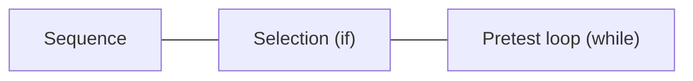
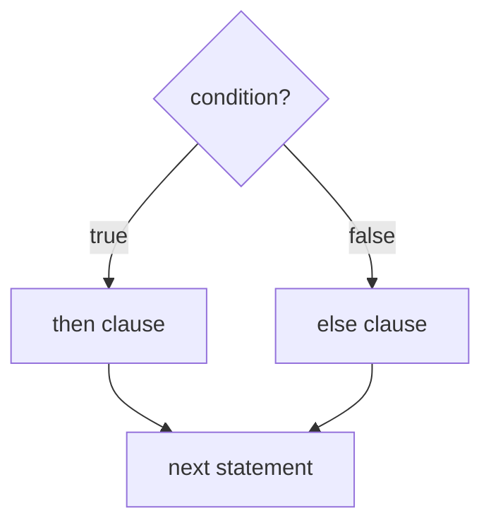
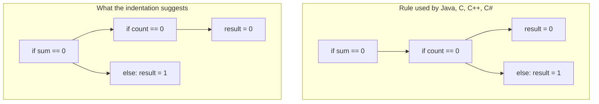
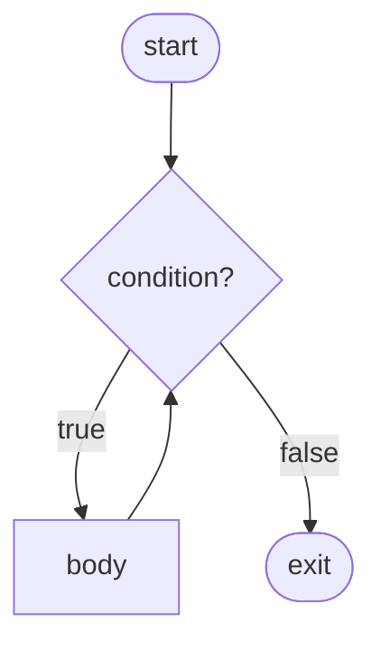
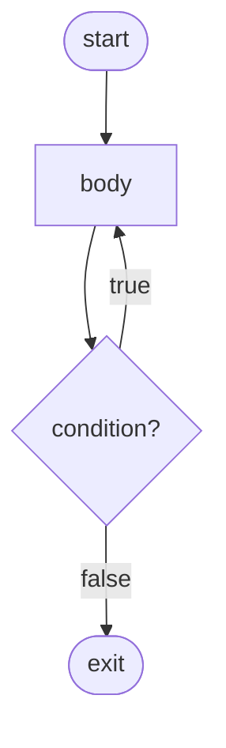

# Programming Languages
## Week 6 — Part 2: Statement-Level Control Structures

Sebesta, Chapter 8

---

# Today (Part 2)

1. What a control structure is
2. Two-way selection — `if` / `else`, dangling else
3. Multiple selection — `switch`, `case`, `match`, `elif` chains
4. Counter-controlled loops
5. Logically controlled loops — pretest and posttest
6. User-located loop control — `break`, `continue`, labels
7. Iteration over data structures — iterators and generators
8. Unconditional branching — `goto`
9. Guarded commands

---

# Where this fits

| Week | Focus |
| --- | --- |
| 6 Part 1 | Expressions — how values get **computed** and **stored** |
| **6 Part 2** | Control — **which** statements run, and **how often** |
| 7 | Midterm (Weeks 1–6) |
| Lab 2 | Your parser already builds `If` and loop nodes |
| Lab 4 | Your interpreter makes those nodes **run** |

---

# Section 8.1 — Control structures

Without control statements, a program runs top to bottom once. Two things we need:

| Need | Mechanism |
| --- | --- |
| Choose between paths | **Selection** |
| Repeat a path | **Iteration** |

A **control structure** = a control statement **plus** the statements whose execution it controls.

---

# How much control do we need?

**Böhm and Jacopini (1966):** any algorithm can be written with just



Everything else — `for`, `switch`, `do-while`, `break` — exists for **writability** and **readability**, not power.

Design question for every language: how many extra forms are worth the added complexity?

---

# Single entry

Almost all modern control structures have **one entry point**.

| Entry | Exit |
| --- | --- |
| One — agreed on by nearly everyone | One vs **many** — debated (`break`, `return` in the middle) |

Multiple entries make code very hard to read. Multiple exits are a trade-off we will see with `break`.

---

# Section 8.2 — Selection statements

A **selection statement** chooses between two or more execution paths.

| Kind | Example |
| --- | --- |
| Two-way | `if … else …` |
| Multiple | `switch`, `case`, `match`, `elif` chains |

---

# Two-way selection

```text
if control_expression
    then clause
    else clause
```



---

# Design issues — two-way selectors

| Question | Why it matters |
| --- | --- |
| Form and **type** of the control expression? | Can an `int` be a condition? |
| How are the `then` and `else` clauses written? | Braces, `end`, indentation? |
| How is **nested** `if … else` resolved? | Which `if` owns the `else`? |

---

# The control expression

| Language | Syntax | Type allowed |
| --- | --- | --- |
| C, C++ | `if (x)` — parens required | Arithmetic: `0` false, nonzero true |
| Java, C# | `if (x > 0)` — parens required | **Boolean only** |
| Python, Ruby | `if x > 0:` / `if x > 0` — no parens | Any value — "truthy" rules |
| Go, Rust, Swift | `if x > 0 {` — no parens, braces required | Boolean only |

Java rejects `if (count)` where `count` is an `int`. C and Python accept it.

---

# Clause form

| Style | Languages | Example |
| --- | --- | --- |
| Single statement or `{ }` block | C, C++, Java, C#, JS | `if (x) y = 1;` |
| Braces **always** | Go, Rust, Swift, Perl | `if x { y = 1 }` |
| Keyword closes it | Ruby, Lua, Fortran 95, Ada | `if x then … end` |
| Indentation | Python | `if x:` then an indented block |

"Braces always" exists mostly to kill one bug …

---

# Dangling else

```java
if (sum == 0)
    if (count == 0)
        result = 0;
else
    result = 1;
```

The indentation **lies**. Which `if` does the `else` belong to?

Week 2 grammar view: the grammar is **ambiguous** — two parse trees.

---

# Dangling else — two trees



**Static semantics rule:** `else` matches the **nearest** unmatched `if`.

---

# Dangling else — how languages avoid it

| Approach | Languages | Result |
| --- | --- | --- |
| Nearest-`if` rule | C, C++, Java, C# | Legal but easy to misread |
| Braces required | Perl, Go, Rust, Swift | Can't write the ambiguous form |
| Closing keyword | Ruby, Lua, Ada (`end if`) | Nesting is explicit |
| Indentation | Python | Nesting is what you see |

```ruby
if sum == 0 then
  if count == 0 then
    result = 0
  else
    result = 1
  end
end
```

---

# Selector **expressions**

In some languages `if` produces a **value** (Part 1 conditional expressions):

| Language | Example |
| --- | --- |
| ML, F#, OCaml | `let y = if x > 0 then x else 2 * x` |
| Rust, Kotlin, Scala | `let y = if x > 0 { x } else { 2 * x };` |
| Python | `y = x if x > 0 else 2 * x` (separate expression form) |

Rule when `if` is an expression: both branches must have the **same type**, and `else` is usually **required**. What would `y` be if there were no `else`?

---

# Multiple selection

Choose **one** of many paths.

| Design question |
| --- |
| Form and type of the control expression? |
| How are the selectable segments written? |
| Does execution flow **only one** segment, or can it fall into the next? |
| How are case values specified (single, list, range)? |
| What happens if **no** case matches? |

---

# C `switch`

```c
switch (index) {
    case 1:
    case 3: odd += 1;
            sumodd += index;
            break;
    case 2:
    case 4: even += 1;
            sumeven += index;
            break;
    default: printf("Error in switch, index = %d\n", index);
}
```

- Control expression and case values: integer types only
- No match and no `default` → nothing happens
- Without `break`, execution **falls through** into the next segment

---

# Fall-through — feature or bug?

```c
switch (grade) {
    case 'A': printf("Excellent ");
    case 'B': printf("Good ");
    case 'C': printf("Pass");
}
```

`grade = 'A'` prints `Excellent Good Pass`.

| Pro | Con |
| --- | --- |
| Lets several cases share code | Forgetting `break` is a classic bug |
| | Reliability traded for flexibility |

---

# Multiple selection across languages

| Language | Statement | Fall-through? |
| --- | --- | --- |
| C, C++ | `switch` | **Implicit** — need `break` |
| Java (classic) | `switch` with `case X:` | Implicit |
| Java 14+ | `switch` with `case X ->` | No |
| C# | `switch` | **Compile error** unless the segment ends in `break`, `goto`, `return` |
| Go, Swift | `switch` | No — opt in with `fallthrough` |
| Ruby | `case … when` | No |
| Rust | `match` (must cover every case) | No |
| Python 3.10+ | `match … case` | No |

Java 7+ and C# also allow **strings** as the control expression.

---

# Modern pattern matching

```python
match command.split():
    case ["go", direction]:
        move(direction)
    case ["pick", "up", item]:
        pick_up(item)
    case ["quit"]:
        running = False
    case _:
        print("Unknown command")
```

```rust
let label = match n {
    0 => "zero",
    1 | 2 | 3 => "small",
    4..=9 => "medium",
    _ => "large",
};
```

Cases match on **shape**, not just equal values. Rust refuses to compile a `match` that misses a case.

---

# Multiple selection with `if`

When cases are **conditions**, not values, use a chain:

| Language | Keyword |
| --- | --- |
| Python | `elif` |
| Ruby, Perl | `elsif` |
| Ada | `elsif` |
| C-based | `else if` (just a nested `if` in the `else`) |

```python
if count < 10:
    bag1 = True
elif count < 100:
    bag2 = True
elif count < 1000:
    bag3 = True
```

Order matters: the **first** true condition wins.

---

# Lisp / Scheme — `COND`

```scheme
(COND
  ((> x y) "x is greater than y")
  ((< x y) "y is greater than x")
  (ELSE "x and y are equal"))
```

A list of `(condition result)` pairs, checked top to bottom. `COND` is an **expression** — it returns a value.

Same idea as an `elif` chain, and a preview of guarded commands.

---

# How `switch` is implemented

| Case values | Typical translation |
| --- | --- |
| Few | Sequence of conditional branches |
| Many, dense (1, 2, 3, …, 50) | **Jump table** — index into an array of addresses |
| Many, sparse | Hash table or binary search |

A jump table is why C restricted `switch` to integers: the value becomes an array index.

---

# Section 8.3 — Iterative statements

Repeat a statement or block zero, one, or more times.

| Design question | Options |
| --- | --- |
| How is iteration **controlled**? | Counter, logical condition, or a data structure |
| **Where** is the test? | Top (**pretest**) or bottom (**posttest**) |

Functional languages often use **recursion** instead (Week 12).

---

# Pretest vs posttest

**Pretest — `while`**



**Posttest — `do-while`**



| Form | Body runs at least … |
| --- | --- |
| Pretest | 0 times |
| Posttest | 1 time |

---

# Counter-controlled loops

A **loop variable** plus an **initial** value, a **terminal** value, and a **step size**.

| Design question | Why it matters |
| --- | --- |
| Type and **scope** of the loop variable? | Does it exist after the loop? |
| Can the body **change** the loop variable? | Can a loop skip or repeat forever? |
| Can the body change the loop **bounds**? | Are they evaluated once or every time? |
| What is the loop variable's value **after** the loop? | Is it defined at all? |

---

# Counter loops across languages

| Language | Syntax |
| --- | --- |
| Fortran | `Do count = 1, 10, 2` |
| Ada | `for count in 1..10 loop … end loop;` |
| C, C++, Java | `for (i = 0; i < 10; i++)` |
| Python | `for i in range(0, 10, 2):` |
| Ruby | `1.step(10, 2) { \|i\| … }` or `(1..10).each` |
| Rust, Kotlin, Swift | `for i in 0..10` |

---

# Loop variable rules differ

| Language | Change loop var in body? | Bounds evaluated | Loop var after loop |
| --- | --- | --- | --- |
| Ada | **Illegal** | Once | Does not exist (scope is the loop) |
| C, C++ | Allowed — affects the loop | **Every** iteration | Still exists (unless declared in the `for`) |
| Java, C# | Allowed | Every iteration | Scoped to the loop if declared there |
| Python | Allowed, but next iteration **resets** it | Once (`range` built up front) | Keeps its last value |

```python
for i in range(3):
    i = 100          # has no effect on the next iteration
print(i)             # 100
```

---

# C's `for` is really a `while`

```c
for (expr_1; expr_2; expr_3)
    body;
```

is the same as

```c
expr_1;
while (expr_2) {
    body;
    expr_3;
}
```

- Every expression is **optional**: `for (;;)` is an infinite loop
- Commas allow several: `for (i = 0, j = 10; i < j; i++, j--)`
- Flexible and easy to misuse — no real "loop variable" at all

---

# Python loops have an `else`

```python
for n in numbers:
    if n < 0:
        print("found a negative")
        break
else:
    print("no negatives")
```

The `else` runs only if the loop **finished without** `break`.

Useful for searches. Also one of Python's most misunderstood features.

---

# Logically controlled loops

Repetition controlled by a **Boolean** condition — more general than counting.

| Language | Pretest | Posttest |
| --- | --- | --- |
| C, C++, Java, C# | `while (cond)` | `do { … } while (cond);` |
| Swift | `while cond` | `repeat { … } while cond` |
| Perl, Ruby | `while` / `until` | `begin … end while` / `until` |
| Python | `while cond:` | — (use `while True:` + `break`) |
| Go | `for cond { … }` | — |
| Rust | `while cond` | — (use `loop` + `break`) |

Go has **one** loop keyword: `for` does counting, conditions, and infinite loops.

---

# Section 8.3 — User-located loop control

Sometimes the natural exit is in the **middle** of the body.

```python
while True:
    line = input()
    if line == "quit":
        break
    process(line)
```

| Statement | Effect |
| --- | --- |
| `break` | Leave the loop now |
| `continue` | Skip the rest of this iteration, go to the next test |

---

# Leaving **nested** loops

```java
outerLoop:
for (row = 0; row < numRows; row++)
    for (col = 0; col < numCols; col++) {
        sum += mat[row][col];
        if (sum > 1000.0)
            break outerLoop;
    }
```

| Language | Exit several loops at once |
| --- | --- |
| Java, Perl, Rust, Go, Swift, Kotlin | **Labeled** `break` / `continue` |
| C, C++, Python | Only innermost — use a flag, a function `return`, or `goto` (C) |

---

# Multiple exits — the trade-off

| Pro | Con |
| --- | --- |
| No flag variables | More than one way out — harder to reason about |
| Code reads in the natural order | Proofs of correctness get harder |

`break` and `continue` are **restricted** `goto`s: they can only jump to one well-defined place.

---

# Section 8.3 — Iteration based on data structures

Let the **data** decide how many times to loop.

```python
for name in ["Ada", "Grace", "Alan"]:
    print(name)
```

The loop asks an **iterator**: "give me the next element, or tell me you are done."

---

# Iterators across languages

| Language | Syntax |
| --- | --- |
| Python | `for x in collection:` |
| Java 5+ | `for (String s : list)` — any `Iterable` |
| C# | `foreach (string s in list)` |
| C++11 | `for (auto& s : vec)` |
| JavaScript | `for (const s of list)` |
| Ruby | `list.each { \|s\| … }` — a **block** passed to a method |
| Rust | `for s in list.iter()` |

---

# How Python's `for` works

```python
for x in items:
    body
```

is roughly:

```python
it = iter(items)
while True:
    try:
        x = next(it)
    except StopIteration:
        break
    body
```

Anything with `__iter__` and `__next__` can go in a `for` — lists, files, dictionaries, your own classes.

---

# Your own iterator

```python
class Countdown:
    def __init__(self, start):
        self.current = start

    def __iter__(self):
        return self

    def __next__(self):
        if self.current <= 0:
            raise StopIteration
        self.current -= 1
        return self.current + 1

for n in Countdown(3):
    print(n)          # 3 2 1
```

---

# Generators — iterators the easy way

```python
def countdown(start):
    while start > 0:
        yield start
        start -= 1

for n in countdown(3):
    print(n)          # 3 2 1
```

`yield` hands back one value and **pauses** the function. The next `next()` resumes right after the `yield`.

| Language | Generators |
| --- | --- |
| Python, JavaScript, C# | `yield` |
| Ruby | blocks + `yield` to the caller's block |
| Kotlin | `sequence { yield(x) }` |

Returns in Week 8 (coroutines).

---

# Section 8.4 — Unconditional branching

`goto label` — transfer control **anywhere**.

```c
    i = 0;
loop:
    if (i >= n) goto done;
    sum += a[i];
    i++;
    goto loop;
done:
    printf("%d\n", sum);
```

The most powerful control statement — and that is the problem.

---

# "Go To Statement Considered Harmful"

**Dijkstra, 1968:** unrestricted `goto` makes the order of execution in the **text** unrelated to the order of execution at **run time**.

| Pro | Con |
| --- | --- |
| Can express any control flow | "Spaghetti code" — hard to read, test, and prove |
| Useful in machine-generated code | Every label is a possible entry point |

This started the **structured programming** movement.

---

# `goto` across languages

| Language | Status |
| --- | --- |
| Fortran, BASIC, assembly | Central to the language |
| C, C++ | Available, rarely used (error cleanup) |
| C# | Available — also used for `goto case` in `switch` |
| Go | Available, restricted (can't jump into blocks) |
| Java | `goto` is a **reserved word** that does nothing |
| Python, Ruby, Rust, Swift | Not available |

Loop exits (`break`, labeled `break`) and exceptions replaced almost every real use.

---

# Section 8.5 — Guarded commands

**Dijkstra, 1975.** Goal: control structures that support **verification** during development.

A **guard** is a Boolean expression. `->` means "if this guard is true, you may run this."

```text
if <Boolean expr> -> <statement>
[] <Boolean expr> -> <statement>
[] ...
[] <Boolean expr> -> <statement>
fi
```

`[]` is called a **fatbar** — it separates the choices.

---

# Guarded selection — `if … fi`

1. Evaluate **all** the guards
2. If more than one is true, pick **any one** of them — nondeterministically
3. If **none** is true → **run-time error**

```text
if x >= y -> max := x
[] y >= x -> max := y
fi
```

When `x == y`, both are true — and it doesn't matter which runs. The programmer did not have to pick an arbitrary order.

---

# Compare to a normal `if`

```python
if x >= y:
    max = x
else:
    max = y
```

| Normal `if` | Guarded `if` |
| --- | --- |
| Order of tests is fixed | No order — all guards equal |
| Falls to `else` silently | No true guard → error, forcing you to think about every case |
| Deterministic | Nondeterministic when guards overlap |

---

# Guarded loop — `do … od`

1. Evaluate all guards
2. If one or more is true, run **one** of them, then repeat
3. When **none** is true, the loop ends

```text
do q1 > q2 -> temp := q1; q1 := q2; q2 := temp;
[] q2 > q3 -> temp := q2; q2 := q3; q3 := temp;
[] q3 > q4 -> temp := q3; q3 := q4; q4 := temp;
od
```

Sorts `q1 ≤ q2 ≤ q3 ≤ q4`. The loop only stops when **no** pair is out of order — which is exactly the definition of sorted.

---

# Why guarded commands still matter

| Idea | Where it shows up |
| --- | --- |
| Pick any ready option | Go `select`, Ada `select` — concurrency (Week 11) |
| "No match is an error" | Rust `match` must be exhaustive |
| Conditions without order | Erlang / Haskell guards: `f x \| x > 0 = …` |

```go
select {
case msg := <-inbox:
    handle(msg)
case <-timeout:
    giveUp()
}
```

If both channels are ready, Go picks one **at random**.

---

# Section 8.6 — Conclusions

| Needed (Böhm–Jacopini) | Added for convenience |
| --- | --- |
| Sequence | `for`, `do-while`, `foreach` |
| Selection | `switch`, `match`, `elif` |
| Pretest loop | `break`, `continue`, labeled exits |

- Too **few** control structures → awkward code with flags
- Too **many** → a bigger language to learn and read
- Unrestricted `goto` is gone from most modern languages; restricted jumps remain

---

# Quick map

| Topic | One-line takeaway |
| --- | --- |
| Control structure | Control statement + the statements it controls |
| Dangling else | Ambiguous nesting — fixed by a rule, braces, `end`, or indentation |
| `switch` fall-through | Flexible in C; removed or opt-in in newer languages |
| Pattern matching | Match on shape; Rust requires every case |
| Counter loop | Rules on loop variable scope and changes differ a lot |
| Pretest vs posttest | 0 or more runs vs 1 or more |
| `break` / `continue` | Restricted `goto` for middle-of-loop exits |
| Iterator | The data structure decides how many times to loop |
| Generator | A function that `yield`s values one at a time |
| `goto` | Most powerful, least readable |
| Guarded commands | Unordered, nondeterministic choices; no true guard → error |

---

# Tie-back to Labs 2 and 4

Your Lab 2 parser already builds these nodes. Lab 4 decides what they **do**.

| Design choice | Pick one and document it |
| --- | --- |
| Condition type | Boolean only? Or truthy values (`0`, `""`)? |
| Dangling else | Which rule? (Already in your grammar) |
| Loop forms | `while` only? Counter `for`? `for each`? |
| Loop variable | Scoped to the loop? Alive after? |
| Early exit | `break` / `continue`? |
| Multiple selection | `elif` chain? `switch`? Fall-through? |

---

# Control in an evaluator

Operational semantics (Week 3) in code:

```python
def exec_stmt(node, env):
    if node.kind == "If":
        if truthy(eval_expr(node.cond, env)):
            exec_block(node.then_body, env)
        elif node.else_body is not None:
            exec_block(node.else_body, env)

    elif node.kind == "While":
        while truthy(eval_expr(node.cond, env)):
            exec_block(node.body, env)
```

The **host** language's `if` and `while` implement **your** language's `if` and `while`.

---

# `break` in an evaluator

One common approach: raise an exception and catch it at the loop.

```python
class BreakSignal(Exception):
    pass

def exec_stmt(node, env):
    if node.kind == "Break":
        raise BreakSignal()

    elif node.kind == "While":
        try:
            while truthy(eval_expr(node.cond, env)):
                exec_block(node.body, env)
        except BreakSignal:
            pass
```

A `break` deep inside nested `if`s unwinds straight back to the nearest loop — the same job a jump does in machine code.

---

# Week 6 Part 2 wrap

You should be able to:

- Explain why sequence, selection, and pretest loops are sufficient — and why languages add more
- Show the dangling-else problem and three ways languages solve it
- Compare `switch` designs: fall-through, types allowed, what happens with no match
- Contrast pretest and posttest loops; compare loop-variable rules across languages
- Explain how Python's `for` uses `iter` / `next`, and what `yield` does
- Summarize the `goto` debate
- Trace a guarded `if` and a guarded `do` loop

---

# Before the midterm

**Read (if not done):** finish Chapter 8

**Midterm (Week 7):** covers Weeks 1–6

**Lab 2:** your grammar's `if` and loop rules are the syntax half of today's lecture

---

# Quick check prompts

1. Rewrite the dangling-else Java example with braces so it matches its indentation.
2. What does the C `switch` on `'A'` print, and what one-word change fixes it?
3. In Python, `for i in range(5): i = 10`. How many times does the loop run? What is `i` afterward?
4. Give a situation where a posttest loop is more natural than a pretest loop.
5. Why is `break` considered safer than `goto`?
6. Trace `if x >= y -> max := x [] y >= x -> max := y fi` with `x = 3, y = 3`. With `x = 3, y = 5`.
7. In the guarded `do` loop that sorts four values, why does the loop always end?
8. In your Lab 4 language, is `if 0:` legal? What does it do?
